<style>
.kable thead tr th, .table thead tr th {
  text-align: left !important;}
table.kable, table.table {
  width: 100% !important;}
  body {
  line-height: 1.6;
  font-size: 16px
}
</style>


# Align Boundaries across Years

**Annotation:** This study selects Census Tracts as the unit of analysis and constructs datasets based on data from 2010 to 2015 and from 2015 to 2020. Since the boundaries of Census Tracts change over time, to ensure comparability across different datasets over time, it is necessary to harmonize the boundaries of the Census Tracts for the years 2010, 2015, and 2020.

## Load Boundaries

- Source: https://www.census.gov/cgi-bin/geo/shapefiles/index.php  
- Join Key: NAME & TRACTCE (Defined by TIGER/Line)  
- CRS: NAD 1983 (CORS96) SPCS Illinois East (US Feet)  https://epsg.io/103272


```r
tracts10 <- st_read(here::here("data/raw/tracts/tl_2010_17_tract10/tl_2010_17_tract10.shp"))%>%
  filter(COUNTYFP10 == '031')%>%  
  st_transform('ESRI:103272')%>%
  select(TRACTCE10, NAME10)

tracts15 <- st_read(here::here("data/raw/tracts/tl_2015_17_tract/tl_2015_17_tract.shp"))%>%
  filter(COUNTYFP == '031')%>%  
  st_transform(crs = st_crs(tracts10))%>%
  select(TRACTCE, NAME)

tracts20 <- st_read(here::here("data/raw/tracts/tl_2020_17_tract/tl_2020_17_tract.shp"))%>%
  filter(COUNTYFP == '031')%>%  
  st_transform(crs = st_crs(tracts10))%>%
  select(TRACTCE, NAME)

# plot
plot_tracts.10 <- ggplot() +
  geom_sf(data = tracts10, fill = NA, color = "black") +
  labs(title="2010 CT Boundaries") +
  theme_void()

plot_tracts.15 <- ggplot() +
  geom_sf(data = tracts15, fill = NA, color = "red") +
  labs(title="2015 CT Boundaries") +
  theme_void()

plot_tracts.20 <- ggplot() +
  geom_sf(data = tracts20, fill = NA, color = "blue") +
  labs(title="2020 CT Boundaries") +
  theme_void()

grid.arrange(plot_tracts.10, plot_tracts.15, plot_tracts.20, ncol = 3)
```

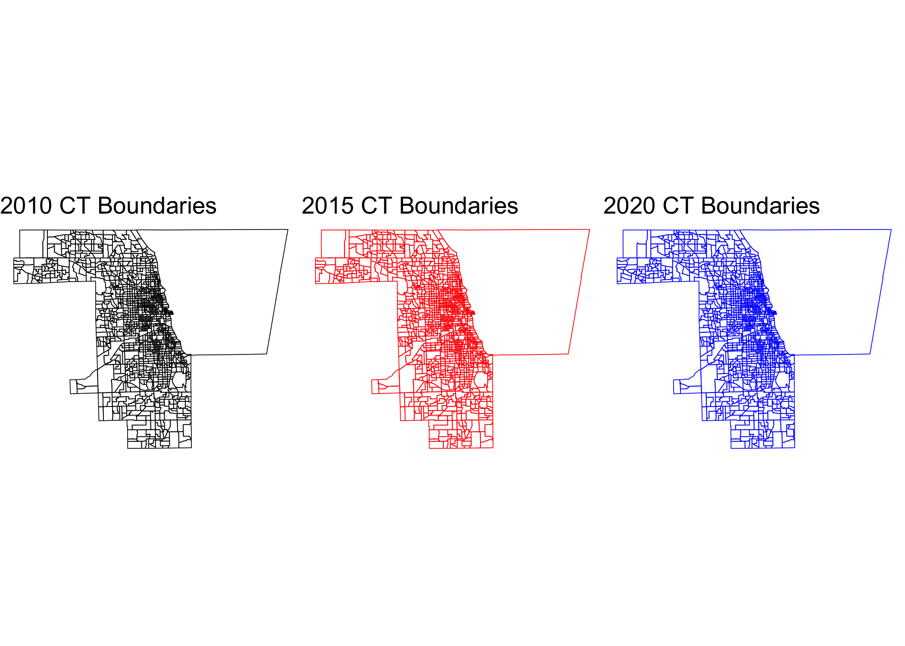<!-- -->

## Compare Boundaries

- The analysis reveals that the boundaries of the Census Tracts in 2010 and 2015 are identical. However, some boundaries have changed by 2020.  
  + `tracts.dif`: Tracts that changed between 2015 and 2020.
  + `tracts.before`：Tracts that existed in 2015 but not in 2020.
  + `tracts.after`：Tracts that exist in 2020 but not in 2015.
- According to the comparative plot of different Census Tracts below, most tracts in 2015 encompass multiple tracts from 2020. Conversely, only the tracts "8447", "6306", "6122", "3806", "8446", "4902", and "4608" in 2020 encompass multiple tracts from 2015.


```r
# find out the difference between shapefiles
tracts.dif <- tracts10 %>%
  st_drop_geometry() %>%
  full_join(tracts15%>%st_drop_geometry()%>% rename(NAME15 = NAME), 
            by = c('TRACTCE10' = 'TRACTCE'))%>%
  full_join(tracts20%>%st_drop_geometry()%>% rename(NAME20 = NAME), 
            by = c('TRACTCE10' = 'TRACTCE'))%>%
  filter(Reduce(`|`, lapply(., is.na)))


# Create a label layer
tracts.before <- tracts.dif %>%
  inner_join(tracts15, by = c('NAME15' = 'NAME')) %>%
  st_as_sf() %>%
  select(TRACTCE, NAME15)%>%
  rename(TRACTCE15 = TRACTCE)%>%
  mutate(centroid = st_centroid(geometry))
  

tracts.after <- tracts.dif %>%
  inner_join(tracts20, by = c('NAME20' = 'NAME')) %>%
  st_as_sf() %>%
  select(TRACTCE, NAME20)%>%
  rename(TRACTCE20 = TRACTCE)%>%
  mutate(centroid = st_centroid(geometry))

# Plots
plot_tracts.before <- ggplot() +
  geom_sf(data = tracts.before, fill = "transparent", color = "red") +
  geom_sf_text(data = tracts.before, aes(label = NAME15, geometry = centroid), color = "black", size = 2, nudge_x = 0.01) +
  labs(title="2010/2015 Census Tracts Boundaries") +
  theme_void()

plot_tracts.after <- ggplot() +
  geom_sf(data = tracts.after, fill = "transparent", color = "blue") +
  geom_sf_text(data = tracts.after, aes(label = NAME20, geometry = centroid), color = "black", size = 2, nudge_x = 0.01) +
  labs(title="2020 Census Tracts Boundaries") +
  theme_void()

grid.arrange(plot_tracts.before, plot_tracts.after, ncol = 2)
```

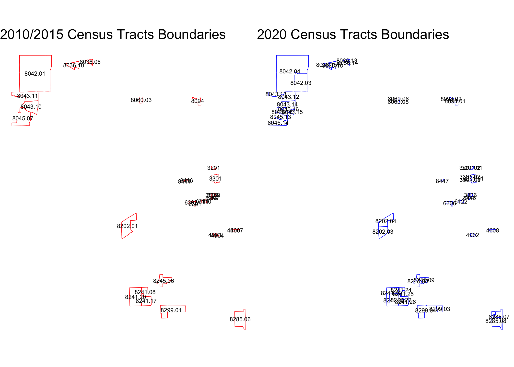<!-- -->

## Prepare Final Boundaries

- To ensure that the analysis units are consistent across the three years, we have selected **the larger tracts** from each year as our final geographic boundaries for the Census Tracts.  
- Identify which tracts merged and which split between 2015 and 2020.  
  + `ct.use15`：Tracts from 2015 that split into multiple tracts by 2020.
  + `ct.use20`：Multiple tracts from 2015 that merged into a single tract by 2020.
- Combine the unchanged Census Tracts from 2015 to 2020 with tracts from `ct.use15` in 2015 and tracts from `ct.use20` in 2020.


```r
# pair polygons
## use 2020 pologons
ct.use20 <- tracts.after %>%
  filter(NAME20 %in% c('8447', '6306', '6122','3806', '8446', '4902', '4608'))%>%
  select(-centroid)%>%
  st_join(tracts.before %>%
            select(-centroid)%>%
            st_buffer(-100))%>%
  st_drop_geometry()%>%
  mutate(TRACTCE = TRACTCE20)

## use 2010/2015 pologons
ct.use15 <- tracts.before %>%
  filter(!(NAME15 %in% ct.use20$NAME15))%>%
  select(-centroid)%>%
  st_join(tracts.after %>%
            filter(!(NAME20 %in% c('8447', '6306','6122', '3806', '8446','4902', '4608')))%>%
            select(-centroid)%>%
            st_buffer(-100))%>%
  st_drop_geometry()%>%
  mutate(TRACTCE = TRACTCE15)

## final shapefile
tracts <- rbind(
  #same ct in 2010/2015 and 2020
  tracts15 %>%
    filter(!(NAME %in% tracts.dif$NAME15))%>%
    mutate(YEAR = 'all'),
  #use ct in 2015
  tracts15 %>%
    filter((NAME %in% ct.use15$NAME15))%>%
    mutate(YEAR = '2015'),
  #use ct in 2020
  tracts20 %>%
    filter((NAME %in% ct.use20$NAME20))%>%
    mutate(YEAR = '2020')
)
```

## Clip Census Tracts to the Chicago Boundary

- We only consider the portion of the tracts that are within the Chicago Boundary and assume that there is no population, amenities, or crime by the seaside.  
- Using Chicago's administrative boundaries, we clip the integrated Census Tracts of Cook County. Additionally, we add information about the neighborhood each Census Tract is located in and calculate their areas.


```r
chicagoBoundary <- 
  st_read(file.path(root.dir, "/Chapter5/chicagoBoundary.geojson")) %>%  # Read Chicago boundary data
  st_transform(crs = st_crs(tracts10))  # Transform coordinate reference system

neighborhoods <- 
  st_read("https://raw.githubusercontent.com/blackmad/neighborhoods/master/chicago.geojson") %>% 
  st_transform(crs = st_crs(tracts10))

# plot
ggplot() +
  geom_sf(data = chicagoBoundary, aes(fill = 'Chicago Boundary'), color = NA) +
  geom_sf(data = tracts, aes(color = 'Census Tracts'), fill = NA) +
  geom_sf(data = neighborhoods, aes(color = 'Neighborhoods'), fill = NA) +
  labs(title = "Census Tracts in Cook County, Chicago Boundary and Neighborhoods",
       fill = " ",  
       color = " ") +  
  theme_void() +
  scale_fill_manual(values = c('Chicago Boundary' = 'grey')) +
  scale_color_manual(values = c('Census Tracts' = 'black', 'Neighborhoods' = 'red'))
```

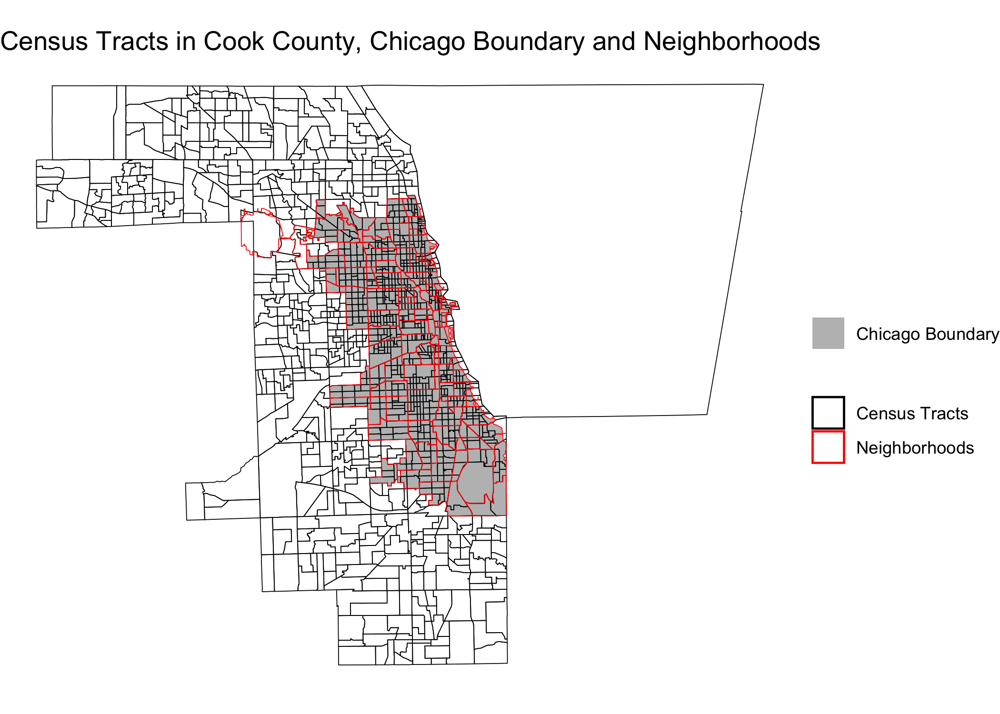<!-- -->

```r
tracts<- 
  st_intersection(chicagoBoundary, tracts)

# add neighborhood factor
tracts.neighborhood <- 
  st_centroid(tracts) %>%
  st_join(neighborhoods) %>% 
  select(TRACTCE, name) %>% 
  st_drop_geometry()

tracts <- tracts %>%
  inner_join(tracts.neighborhood, by = "TRACTCE") %>% 
  mutate(area = st_area(.)) %>% 
  mutate(area = set_units(x = area, value = "acres"))%>%
  mutate(area = as.numeric(area))
```


# Identify Gentrification by K-means

**Annotation:** Existing literature on differentiating gentrification methodologies can be divided into two main approaches. Earlier studies generally employ the threshold approach, which distinguishes gentrification instances using one or multiple criteria. For example, Lance Freeman’s model specifies that a gentrified tract must have below-metro-median household income, a percentage of structures built in the prior 20 years, and above-metro-area increases in college degrees and real housing prices. While the threshold measure is straightforward, its outcomes are highly dependent on arbitrary parameters, making it prone to judgment errors and overlooking regional nuances.  
Comparatively, unsupervised machine learning methods provide new ways of investigating gentrification. Several studies have used K-means clustering to optimize the subgrouping of observations with similar characteristics to differentiate gentrified tracts from others. We choose **the K-means clustering method** to label gentrified Census Tracts for later model development.

## Variables Used for K-means

- The study selects variables for **defining and measuring gentrification**, which are also used as grouping variables in k-means clustering. These variables include the following, along with their changes over the five-year period:  
  + Median Household Income
  + Education Level (Proportion of the population over 25 years old with a bachelor’s degree or above)
  + Percent of White alone (Excluding Hispanic)
  + Percent of Black alone
  + Percent of Hispanic
- When calculating the median income for combined tracts, we treat it as the mean income and calculate the average.

### 2010 ACS Data

- Data for 2010 comes from the 2010 5-year American Community Survey (ACS). The calculation methods are as follows:
  + For tracts whose boundaries have not changed between 2010 and 2020 and that are not part of `ct.use20`, the above variables are directly calculated.
  + For tracts that are part of `ct.use20`, which are multiple tracts from 2010 merged into a single tract by 2020, the original data for some 2010 tracts are first merged based on "TRACTCE" before calculation.


```r
#retrieving and renaming 2010 data
dat10 <-
  get_acs(geography = "tract",
          variables = c("B01003_001E", #total population
                        "B15002_001E", #total population 25 and above
                        "B11016_001E", #total households
                        "B25034_001E", #total structures
                        "B25024_001E", #total units
                        "B07003_001E", #total population one year and over
                        "B19013_001E", #median household income
                        "B15002_015E", "B15002_016E", "B15002_017E", "B15002_018E", #education male
                        "B15002_032E", "B15002_033E", "B15002_034E", "B15002_035E", #education female
                        "B03002_003E", "B03002_004E", "B03002_012E", #white, black, and hispanic, 
                        "B25034_002E", #new structures built in past 5 years
                        "B25004_001E", #total vacant units
                        "B07003_004E"), #population same house 1-yr ago
          year=2010, state=17,
          county=031, geometry=FALSE)

dat10 <- 
  dat10 %>%
  dplyr::select(-moe) %>%
  spread(key = variable, value = estimate) %>%
  mutate(tot.abovebach10 = B15002_015 + B15002_016 + B15002_017 + B15002_018 +
         B15002_032 + B15002_033 + B15002_034 + B15002_035) %>% 
  rename(tot.pop10 = B01003_001,
         tot.pop25above10 = B15002_001,
         tot.hh10 = B11016_001,
         tot.struc10 = B25034_001,
         tot.unit10 = B25024_001,
         tot.residence1yr10 = B07003_001,
         hh.inc10 = B19013_001,
         white10 = B03002_003, black10 = B03002_004, hispanic10 = B03002_012,
         struc5yrs10 = B25034_002,
         vacant10 = B25004_001,
         tot.same1yr10 = B07003_004)

dat10 <- 
  dat10 %>%
  dplyr::select(NAME,
                tot.pop10, tot.pop25above10, tot.hh10, tot.struc10, tot.unit10, tot.residence1yr10, 
                hh.inc10, tot.abovebach10, white10, black10, hispanic10, struc5yrs10, vacant10, tot.same1yr10) %>% 
  mutate(NAME10 = str_extract(NAME, "-?\\d+\\.?\\d*")) %>% 
  select(-NAME)

# modifying data to accomodate master shapefile
dat10a <- dat10 %>% 
  filter(!(NAME10 %in% ct.use20$NAME15)) %>% 
  inner_join(tracts, by = c('NAME10'='NAME')) %>% 
  select(-NAME10)

dat10b <- dat10 %>% 
  filter(NAME10 %in% ct.use20$NAME15) %>% 
  inner_join(ct.use20, by = c('NAME10'='NAME15')) %>% 
  na.omit() 

dat10b <- dat10b %>% 
  mutate(tot.inc10 = tot.hh10*hh.inc10) %>% # median income calculation
  group_by(TRACTCE) %>% 
  summarize(tot.pop10 = sum(tot.pop10),
            tot.pop25above10 = sum(tot.pop25above10),
            tot.hh10 = sum(tot.hh10),
            tot.struc10 = sum(tot.struc10),
            tot.unit10 = sum(tot.unit10),
            tot.residence1yr10 = sum(tot.residence1yr10),
            tot.abovebach10 = sum(tot.abovebach10),
            hh.inc10 = sum(tot.inc10)/sum(tot.hh10),
            white10 = sum(white10),
            black10 = sum(black10),
            hispanic10 = sum(hispanic10),
            struc5yrs10 = sum(struc5yrs10),
            vacant10 = sum(vacant10),
            tot.same1yr10 = sum(tot.same1yr10)) %>% 
  inner_join(tracts, by = 'TRACTCE') %>% 
  select(-NAME)

dat10.new <- rbind(dat10a, dat10b)

dat10.new <- 
  dat10.new %>%
  mutate(pct.white10 = (white10/tot.pop10)*100,
         pct.black10 = (black10/tot.pop10)*100,
         pct.hispanic10 = (hispanic10/tot.pop10)*100,
         pct.bachabove10 = (tot.abovebach10/tot.pop25above10)*100,
         vacant.rate10 = (vacant10/tot.unit10)*100)

dat10.new <- dat10.new %>%
  select(TRACTCE, everything())
```

### 2015 ACS Data

- Data for 2015 comes from the 2015 5-year American Community Survey (ACS). The calculation methods are as follows:
  + For tracts whose boundaries have not changed between 2015 and 2020 and that are not part of `ct.use20`, the above variables are directly calculated.
  + For tracts that are part of `ct.use20`, which are multiple tracts from 2015 merged into a single tract by 2020, the original data for some 2015 tracts are first merged based on "TRACTCE" before calculation.


```r
dat15 <-
  get_acs(geography = "tract",
          variables = c("B01003_001E", #total population
                        "B15003_001E", #total population 25 and above
                        "B11016_001E", #total households
                        "B25034_001E", #total structures
                        "B25024_001E", #total units
                        "B07003_001E", #total population one year and over
                        "B19013_001E", #median household income
                        "B15003_022E", "B15003_023E", "B15003_024E", "B15003_025E", #education
                        "B03002_003E", "B03002_004E", "B03002_012E", #white, black, and hispanic, 
                        "B25034_002E", #new structures built in past 5 years
                        "B25004_001E", #total vacant units
                        "B07003_004E"), #population same house 1-yr ago
          year=2015, state=17,
          county=031, geometry=FALSE)

dat15 <- 
  dat15 %>%
  dplyr::select(-moe) %>%
  spread(key = variable, value = estimate) %>%
  mutate(tot.abovebach15 = B15003_022 + B15003_023 + B15003_024 + B15003_025) %>% 
  rename(tot.pop15 = B01003_001,
         tot.pop25above15 = B15003_001,
         tot.hh15 = B11016_001,
         tot.struc15 = B25034_001,
         tot.unit15 = B25024_001,
         tot.residence1yr15 = B07003_001,
         hh.inc15 = B19013_001,
         white15 = B03002_003, black15 = B03002_004, hispanic15 = B03002_012,
         struc5yrs15 = B25034_002,
         vacant15 = B25004_001,
         tot.same1yr15 = B07003_004)

dat15 <- 
  dat15 %>%
  dplyr::select(NAME,
                tot.pop15, tot.pop25above15, tot.hh15, tot.struc15, tot.unit15, tot.residence1yr15, 
                hh.inc15, tot.abovebach15, white15, black15, hispanic15, struc5yrs15, vacant15, tot.same1yr15) %>%
  mutate(NAME15 = str_extract(NAME, "-?\\d+\\.?\\d*")) %>% 
  select(-NAME)

#modifying data to accomodate master shapefile
dat15a <- dat15 %>% 
  filter(!(NAME15 %in% ct.use20$NAME15)) %>% 
  inner_join(tracts, by = c('NAME15'='NAME')) %>% 
  select(-NAME15)

dat15b <- dat15 %>% 
  filter(NAME15 %in% ct.use20$NAME15) %>% 
  inner_join(ct.use20, by = 'NAME15') %>% 
  na.omit() 

dat15b <- dat15b %>% 
  mutate(tot.inc15 = tot.hh15*hh.inc15) %>%
  group_by(TRACTCE) %>% 
  summarize(tot.pop15 = sum(tot.pop15),
            tot.pop25above15 = sum(tot.pop25above15),
            tot.hh15 = sum(tot.hh15),
            tot.struc15 = sum(tot.struc15),
            tot.unit15 = sum(tot.unit15),
            tot.residence1yr15 = sum(tot.residence1yr15),
            tot.abovebach15 = sum(tot.abovebach15),
            hh.inc15 = sum(tot.inc15)/sum(tot.hh15), #perhaps better if changed to weighted mean
            white15 = sum(white15),
            black15 = sum(black15),
            hispanic15 = sum(hispanic15),
            struc5yrs15 = sum(struc5yrs15),
            vacant15 = sum(vacant15),
            tot.same1yr15 = sum(tot.same1yr15))%>%   
  inner_join(tracts, by = 'TRACTCE') %>% 
  select(-NAME)

dat15.new <- rbind(dat15a, dat15b)

dat15.new <- 
  dat15.new %>%
  mutate(pct.white15 = (white15/tot.pop15)*100,
         pct.black15 = (black15/tot.pop15)*100,
         pct.hispanic15 = (hispanic15/tot.pop15)*100,
         pct.bachabove15 = (tot.abovebach15/tot.pop25above15)*100,
         vacant.rate15 = (vacant15/tot.unit15)*100,
         pct.struc5yrs15 = (struc5yrs15/tot.unit15)*100,
         pct.migration1yr15 = (1-tot.same1yr15/tot.pop15)*100)

dat15.new <- dat15.new %>%
  select(TRACTCE, everything())
```

### 2020 ACS Data

- Data for 2020 comes from the 2020 5-year American Community Survey (ACS). The calculation methods are as follows:
  + For tracts whose boundaries have not changed between 2015 and 2020 and that are not part of `ct.use15`, the above variables are directly calculated.
  + For tracts that are part of `ct.use15`, which represent tracts from 2015 that split into multiple tracts by 2020, the original data for some 2020 tracts are first merged based on "TRACTCE" before calculation.


```r
dat20 <-
  get_acs(geography = "tract",
          variables = c("B01003_001E", #total population
                        "B15003_001E", #total population 25 and above
                        "B11016_001E", #total households
                        "B25034_001E", #total structures
                        "B25024_001E", #total units
                        "B07003_001E", #total population one year and over
                        "B19013_001E", #median household income
                        "B15003_022E", "B15003_023E", "B15003_024E", "B15003_025E", #education
                        "B03002_003E", "B03002_004E", "B03002_012E", #white, black, and hispanic, 
                        "B25034_002E", #new structures built in past 5 years
                        "B25004_001E", #total vacant units
                        "B07003_004E"), #population same house 1-yr ago
          year=2020, state=17,
          county=031, geometry=FALSE)

dat20 <- 
  dat20 %>%
  dplyr::select(-moe) %>%
  spread(key = variable, value = estimate) %>%
  mutate(tot.abovebach20 = B15003_022 + B15003_023 + B15003_024 + B15003_025) %>% 
  rename(tot.pop20 = B01003_001,
         tot.pop25above20 = B15003_001,
         tot.hh20 = B11016_001,
         tot.struc20 = B25034_001,
         tot.unit20 = B25024_001,
         tot.residence1yr20 = B07003_001,
         hh.inc20 = B19013_001,
         white20 = B03002_003, black20 = B03002_004, hispanic20 = B03002_012,
         struc5yrs20 = B25034_002,
         vacant20 = B25004_001,
         tot.same1yr20 = B07003_004)

dat20 <- 
  dat20 %>%
  dplyr::select(NAME,
                tot.pop20, tot.pop25above20, tot.hh20, tot.struc20, tot.unit20, tot.residence1yr20, 
                hh.inc20, tot.abovebach20, white20, black20, hispanic20, struc5yrs20, vacant20, tot.same1yr20) %>%
  mutate(NAME20 = str_extract(NAME, "-?\\d+\\.?\\d*")) %>% 
  select(-NAME)

#modifying data to accomodate master shapefile
dat20a <- dat20 %>% 
  filter(!(NAME20 %in% ct.use15$NAME20)) %>% 
  inner_join(tracts, by = c('NAME20'='NAME')) %>% 
  select(-NAME20)

dat20b <- dat20 %>% 
  filter(NAME20 %in% ct.use15$NAME20) %>% 
  inner_join(ct.use15, by = 'NAME20') %>% 
  na.omit()

dat20b <- dat20b %>% 
  mutate(tot.inc20 = tot.hh20*hh.inc20) %>% 
  group_by(TRACTCE) %>% 
  summarize(tot.pop20 = sum(tot.pop20),
            tot.pop25above20 = sum(tot.pop25above20),
            tot.hh20 = sum(tot.hh20),
            tot.struc20 = sum(tot.struc20),
            tot.unit20 = sum(tot.unit20),
            tot.residence1yr20 = sum(tot.residence1yr20),
            tot.abovebach20 = sum(tot.abovebach20),
            hh.inc20 = sum(tot.inc20)/sum(tot.hh20),
            white20 = sum(white20),
            black20 = sum(black20),
            hispanic20 = sum(hispanic20),
            struc5yrs20 = sum(struc5yrs20),
            vacant20 = sum(vacant20),
            tot.same1yr20 = sum(tot.same1yr20))%>%   
  inner_join(tracts, by = 'TRACTCE') %>% 
  select(-NAME)

dat20.new <- rbind(dat20a, dat20b)

dat20.new <- dat20.new %>%
  mutate(pct.white20 = (white20/tot.pop20)*100,
         pct.black20 = (black20/tot.pop20)*100,
         pct.hispanic20 = (hispanic20/tot.pop20)*100,
         pct.bachabove20 = (tot.abovebach20/tot.pop25above20)*100,
         vacant.rate20 = (vacant20/tot.unit20)*100,
         pct.struc5yrs20 = (struc5yrs20/tot.unit20)*100,
         pct.migration1yr20 = (1-tot.same1yr20/tot.pop20)*100)
  
dat20.new <- dat20.new %>%
  select(TRACTCE, everything())
```

## Calculate Five-Year Changes in Variables

- Changes in selected variables from 2010-2015 and 2015-2020 are calculated and merged with the original data, forming datasets for 2015 and 2020 respectively. The former dataset is used to build the predictive model, while the latter is used for cross-time validation.  
- To ensure consistency in comparisons, income variables from all three years are adjusted to the 2020 inflation rate.  
- To ensure the machine learning model uses the same criteria for identifying gentrification in both years, records from each year (i.e., each tract in the K-means dataset has two observations, one for 2015 and one for 2020) are included in the test. K-means clustering was performed on 1706 records.


```r
dat15.k <- dat15.new %>% 
  left_join(dat10.new, by = "TRACTCE") %>% 
  mutate(hh.inc10 = hh.inc10*1.19, #adjust for 2020 inflation rate
         hh.inc15 = hh.inc15*1.09, #adjust for 2020 inflation rate
         ch_hhinc = hh.inc15-hh.inc10,
         ch_bachabove = pct.bachabove15 - pct.bachabove10,
         ch_pctwhite = pct.white15 - pct.white10,
         ch_pctblack = pct.black15 - pct.black10,
         ch_pcthispanic = pct.hispanic15 - pct.hispanic10,
         year = "2015") %>% 
  select(TRACTCE, year, 
         hh.inc15, ch_hhinc,
         pct.bachabove15, ch_bachabove, 
         pct.white15, ch_pctwhite,
         pct.black15, ch_pctblack,
         pct.hispanic15, ch_pcthispanic) %>% 
  rename(hh.inc = hh.inc15,
         pct.white = pct.white15,
         pct.black = pct.black15,
         pct.hispanic = pct.hispanic15,
         pct.bachabove = pct.bachabove15)

dat20.k <- dat20.new %>% 
  left_join(dat15.new, by = "TRACTCE") %>% 
  mutate(hh.inc15 = hh.inc15*1.09, #adjust for 2020 inflation rate
         ch_hhinc = hh.inc20-hh.inc15,
         ch_bachabove = pct.bachabove20 - pct.bachabove15,
         ch_pctwhite = pct.white20 - pct.white15,
         ch_pctblack = pct.black20 - pct.black15,
         ch_pcthispanic = pct.hispanic20 - pct.hispanic15,
         year = "2020") %>% 
  select(TRACTCE, year, 
         hh.inc20, ch_hhinc,
         pct.bachabove20, ch_bachabove, 
         pct.white20, ch_pctwhite,
         pct.black20, ch_pctblack,
         pct.hispanic20, ch_pcthispanic) %>% 
  rename(hh.inc = hh.inc20,
         pct.white = pct.white20,
         pct.black = pct.black20,
         pct.hispanic = pct.hispanic20,
         pct.bachabove = pct.bachabove20)

dat.k <- rbind(dat15.k, dat20.k)

# remove the tract pairs with na
dat.k.na <- dat.k[apply(is.na(dat.k), 1, any), ]
dat.k <- dat.k %>%
  filter(!(TRACTCE %in% dat.k.na$TRACTCE))

data_scaled<- scale(dat.k[3:12])

distance <- get_dist(data_scaled)
```

## Determine Optimal K Value

- To determine the best k value that distinguishes gentrified tracts in Chicago, we iteratively repeated the clustering process for a range of k values from 3 to 8. The resulting clusters are visualized below.


```r
set.seed(1)
k3 <- kmeans(data_scaled, centers = 3, nstart = 25)
k4 <- kmeans(data_scaled, centers = 4, nstart = 25)
k5 <- kmeans(data_scaled, centers = 5, nstart = 25)
k6 <- kmeans(data_scaled, centers = 6, nstart = 25)
k7 <- kmeans(data_scaled, centers = 7, nstart = 25)
k8 <- kmeans(data_scaled, centers = 8, nstart = 25)

p1 <- fviz_cluster(k3, geom = "point",  data = data_scaled) + ggtitle("k = 3")
p2 <- fviz_cluster(k4, geom = "point",  data = data_scaled) + ggtitle("k = 4")
p3 <- fviz_cluster(k5, geom = "point",  data = data_scaled) + ggtitle("k = 5")
p4 <- fviz_cluster(k6, geom = "point",  data = data_scaled) + ggtitle("k = 6")
p5 <- fviz_cluster(k7, geom = "point",  data = data_scaled) + ggtitle("k = 7")
p6 <- fviz_cluster(k8, geom = "point",  data = data_scaled) + ggtitle("k = 8")

grid.arrange(p1, p2, p3, p4, p5, p6, nrow = 3)
```

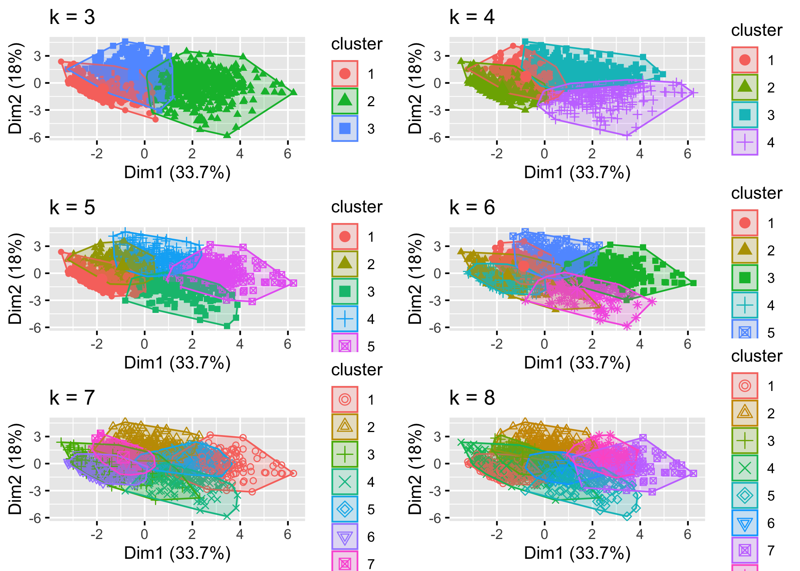<!-- -->

## Summary of K-means Clusters

- After preliminary screening, significant differences between clusters are observed at k=5 and k=6.  
- Between k values 5 and 6, similarities are noted where cluster 3 at k=5 aligns with cluster 6 at k=6. This clustering encapsulates tracts originally characterized by moderate income and educational levels, which see a significant increase in median household income (over $8,000) and in the share of the population with high educational attainment (over a 10% increase, surpassing all other clusters). Additionally, these tracts exhibit the highest increase in the share of the White population, coupled with a simultaneous decrease in the shares of Black and Hispanic populations. Therefore, these tracts are identified as typical gentrified areas in Chicago.  
- To maximize the distinction between groups, k=5 is ultimately selected. The characteristics represented by each cluster under this classification are as follows:
  + Cluster 1 represents predominantly Black neighborhoods that are increasingly poor, characterized by low income and education.
  + Cluster 2 represents stable, predominantly Hispanic neighborhoods with low income and education.
  + **Cluster 3 represents neighborhoods that are increasingly characterized by high income, high education levels, and a growing White population, indicative of gentrification.**
  + Cluster 4 represents high-income White neighborhoods that are becoming increasingly Hispanic.
  + Cluster 5 represents stable, traditionally affluent White neighborhoods that are becoming even wealthier.


```r
#classification not good enough
clusters3<- dat.k %>%
  mutate(cluster3 = k3$cluster) %>%
  group_by(cluster3) %>%
  summarise_all("mean") %>%
  select(-c("TRACTCE", "year"))
kable(x=clusters3)%>%kable_classic()
```

<table class=" lightable-classic" style='color: black; font-family: "Arial Narrow", "Source Sans Pro", sans-serif; margin-left: auto; margin-right: auto;'>
 <thead>
  <tr>
   <th style="text-align:right;"> cluster3 </th>
   <th style="text-align:right;"> hh.inc </th>
   <th style="text-align:right;"> ch_hhinc </th>
   <th style="text-align:right;"> pct.bachabove </th>
   <th style="text-align:right;"> ch_bachabove </th>
   <th style="text-align:right;"> pct.white </th>
   <th style="text-align:right;"> ch_pctwhite </th>
   <th style="text-align:right;"> pct.black </th>
   <th style="text-align:right;"> ch_pctblack </th>
   <th style="text-align:right;"> pct.hispanic </th>
   <th style="text-align:right;"> ch_pcthispanic </th>
  </tr>
 </thead>
<tbody>
  <tr>
   <td style="text-align:right;"> 1 </td>
   <td style="text-align:right;"> 35176.95 </td>
   <td style="text-align:right;"> -993.2078 </td>
   <td style="text-align:right;"> 19.34908 </td>
   <td style="text-align:right;"> 2.143748 </td>
   <td style="text-align:right;"> 4.60516 </td>
   <td style="text-align:right;"> 0.7378226 </td>
   <td style="text-align:right;"> 84.903934 </td>
   <td style="text-align:right;"> -3.8333659 </td>
   <td style="text-align:right;"> 7.176592 </td>
   <td style="text-align:right;"> 2.274418 </td>
  </tr>
  <tr>
   <td style="text-align:right;"> 2 </td>
   <td style="text-align:right;"> 91767.64 </td>
   <td style="text-align:right;"> 10977.9496 </td>
   <td style="text-align:right;"> 64.14087 </td>
   <td style="text-align:right;"> 6.691927 </td>
   <td style="text-align:right;"> 64.64330 </td>
   <td style="text-align:right;"> 1.3711515 </td>
   <td style="text-align:right;"> 7.855929 </td>
   <td style="text-align:right;"> -0.8571115 </td>
   <td style="text-align:right;"> 15.404184 </td>
   <td style="text-align:right;"> -1.925076 </td>
  </tr>
  <tr>
   <td style="text-align:right;"> 3 </td>
   <td style="text-align:right;"> 51559.19 </td>
   <td style="text-align:right;"> -345.9176 </td>
   <td style="text-align:right;"> 20.88626 </td>
   <td style="text-align:right;"> 1.793026 </td>
   <td style="text-align:right;"> 26.10966 </td>
   <td style="text-align:right;"> -3.1606557 </td>
   <td style="text-align:right;"> 7.699117 </td>
   <td style="text-align:right;"> 0.4060525 </td>
   <td style="text-align:right;"> 58.460183 </td>
   <td style="text-align:right;"> 1.968760 </td>
  </tr>
</tbody>
</table>

```r
#rank 4? wealthier region gets increasingly gentrified
clusters4<- dat.k %>%
  mutate(cluster4 = k4$cluster) %>%
  group_by(cluster4) %>%
  summarise_all("mean") %>%
  select(-c("TRACTCE", "year"))
kable(x=clusters4)%>%kable_classic()
```

<table class=" lightable-classic" style='color: black; font-family: "Arial Narrow", "Source Sans Pro", sans-serif; margin-left: auto; margin-right: auto;'>
 <thead>
  <tr>
   <th style="text-align:right;"> cluster4 </th>
   <th style="text-align:right;"> hh.inc </th>
   <th style="text-align:right;"> ch_hhinc </th>
   <th style="text-align:right;"> pct.bachabove </th>
   <th style="text-align:right;"> ch_bachabove </th>
   <th style="text-align:right;"> pct.white </th>
   <th style="text-align:right;"> ch_pctwhite </th>
   <th style="text-align:right;"> pct.black </th>
   <th style="text-align:right;"> ch_pctblack </th>
   <th style="text-align:right;"> pct.hispanic </th>
   <th style="text-align:right;"> ch_pcthispanic </th>
  </tr>
 </thead>
<tbody>
  <tr>
   <td style="text-align:right;"> 1 </td>
   <td style="text-align:right;"> 47844.32 </td>
   <td style="text-align:right;"> -0.1823807 </td>
   <td style="text-align:right;"> 15.32489 </td>
   <td style="text-align:right;"> 2.128519 </td>
   <td style="text-align:right;"> 15.645483 </td>
   <td style="text-align:right;"> -1.6295830 </td>
   <td style="text-align:right;"> 6.210992 </td>
   <td style="text-align:right;"> -0.2996935 </td>
   <td style="text-align:right;"> 72.258653 </td>
   <td style="text-align:right;"> 1.245061 </td>
  </tr>
  <tr>
   <td style="text-align:right;"> 2 </td>
   <td style="text-align:right;"> 35001.39 </td>
   <td style="text-align:right;"> -1076.9012882 </td>
   <td style="text-align:right;"> 18.54456 </td>
   <td style="text-align:right;"> 2.012047 </td>
   <td style="text-align:right;"> 4.000351 </td>
   <td style="text-align:right;"> 0.5885377 </td>
   <td style="text-align:right;"> 85.721877 </td>
   <td style="text-align:right;"> -3.4863754 </td>
   <td style="text-align:right;"> 7.232063 </td>
   <td style="text-align:right;"> 2.230202 </td>
  </tr>
  <tr>
   <td style="text-align:right;"> 3 </td>
   <td style="text-align:right;"> 84037.52 </td>
   <td style="text-align:right;"> 3261.6535296 </td>
   <td style="text-align:right;"> 56.79975 </td>
   <td style="text-align:right;"> 2.061176 </td>
   <td style="text-align:right;"> 64.065575 </td>
   <td style="text-align:right;"> -4.9286244 </td>
   <td style="text-align:right;"> 8.621587 </td>
   <td style="text-align:right;"> 0.4206622 </td>
   <td style="text-align:right;"> 15.293977 </td>
   <td style="text-align:right;"> 3.060048 </td>
  </tr>
  <tr>
   <td style="text-align:right;"> 4 </td>
   <td style="text-align:right;"> 84120.15 </td>
   <td style="text-align:right;"> 16575.1472535 </td>
   <td style="text-align:right;"> 57.96204 </td>
   <td style="text-align:right;"> 11.259352 </td>
   <td style="text-align:right;"> 55.213525 </td>
   <td style="text-align:right;"> 7.6122959 </td>
   <td style="text-align:right;"> 9.176409 </td>
   <td style="text-align:right;"> -2.1375238 </td>
   <td style="text-align:right;"> 23.397784 </td>
   <td style="text-align:right;"> -6.862422 </td>
  </tr>
</tbody>
</table>

```r
#rank 5, not highest income, but peaking increases in income, education attainment, white
clusters5<- dat.k %>%
  mutate(cluster5 = k5$cluster) %>%
  group_by(cluster5) %>%
  summarise_all("mean") %>%
  select(-c("TRACTCE", "year"))
kable(x=clusters5)%>%kable_classic()
```

<table class=" lightable-classic" style='color: black; font-family: "Arial Narrow", "Source Sans Pro", sans-serif; margin-left: auto; margin-right: auto;'>
 <thead>
  <tr>
   <th style="text-align:right;"> cluster5 </th>
   <th style="text-align:right;"> hh.inc </th>
   <th style="text-align:right;"> ch_hhinc </th>
   <th style="text-align:right;"> pct.bachabove </th>
   <th style="text-align:right;"> ch_bachabove </th>
   <th style="text-align:right;"> pct.white </th>
   <th style="text-align:right;"> ch_pctwhite </th>
   <th style="text-align:right;"> pct.black </th>
   <th style="text-align:right;"> ch_pctblack </th>
   <th style="text-align:right;"> pct.hispanic </th>
   <th style="text-align:right;"> ch_pcthispanic </th>
  </tr>
 </thead>
<tbody>
  <tr>
   <td style="text-align:right;"> 1 </td>
   <td style="text-align:right;"> 34954.98 </td>
   <td style="text-align:right;"> -1004.0597 </td>
   <td style="text-align:right;"> 17.95773 </td>
   <td style="text-align:right;"> 1.934311 </td>
   <td style="text-align:right;"> 3.440543 </td>
   <td style="text-align:right;"> 0.5508909 </td>
   <td style="text-align:right;"> 86.746431 </td>
   <td style="text-align:right;"> -3.3330350 </td>
   <td style="text-align:right;"> 7.090503 </td>
   <td style="text-align:right;"> 2.1839197 </td>
  </tr>
  <tr>
   <td style="text-align:right;"> 2 </td>
   <td style="text-align:right;"> 46835.79 </td>
   <td style="text-align:right;"> 244.7271 </td>
   <td style="text-align:right;"> 13.35246 </td>
   <td style="text-align:right;"> 1.740268 </td>
   <td style="text-align:right;"> 12.761002 </td>
   <td style="text-align:right;"> -1.6607730 </td>
   <td style="text-align:right;"> 6.142294 </td>
   <td style="text-align:right;"> -0.5903128 </td>
   <td style="text-align:right;"> 77.045980 </td>
   <td style="text-align:right;"> 1.8331200 </td>
  </tr>
  <tr>
   <td style="text-align:right;"> 3 </td>
   <td style="text-align:right;"> 62372.82 </td>
   <td style="text-align:right;"> 8141.7819 </td>
   <td style="text-align:right;"> 47.69624 </td>
   <td style="text-align:right;"> 11.105235 </td>
   <td style="text-align:right;"> 45.221138 </td>
   <td style="text-align:right;"> 8.3167228 </td>
   <td style="text-align:right;"> 11.576364 </td>
   <td style="text-align:right;"> -1.9801573 </td>
   <td style="text-align:right;"> 30.499874 </td>
   <td style="text-align:right;"> -7.8207485 </td>
  </tr>
  <tr>
   <td style="text-align:right;"> 4 </td>
   <td style="text-align:right;"> 66179.19 </td>
   <td style="text-align:right;"> -922.7315 </td>
   <td style="text-align:right;"> 43.49081 </td>
   <td style="text-align:right;"> 1.028926 </td>
   <td style="text-align:right;"> 55.576755 </td>
   <td style="text-align:right;"> -6.8216845 </td>
   <td style="text-align:right;"> 9.929492 </td>
   <td style="text-align:right;"> 0.6043376 </td>
   <td style="text-align:right;"> 20.780307 </td>
   <td style="text-align:right;"> 4.5036833 </td>
  </tr>
  <tr>
   <td style="text-align:right;"> 5 </td>
   <td style="text-align:right;"> 116410.78 </td>
   <td style="text-align:right;"> 16639.1457 </td>
   <td style="text-align:right;"> 75.08577 </td>
   <td style="text-align:right;"> 5.469283 </td>
   <td style="text-align:right;"> 73.334781 </td>
   <td style="text-align:right;"> -0.3035602 </td>
   <td style="text-align:right;"> 5.894907 </td>
   <td style="text-align:right;"> -0.6482699 </td>
   <td style="text-align:right;"> 10.158134 </td>
   <td style="text-align:right;"> -0.3272932 </td>
  </tr>
</tbody>
</table>

```r
#rank 1, increasingly wealthier hispanic neighborhoods (still considered low income)
#rank 6, not highest income, but peaking increases in income, education attainment, white - similar to cluster5
clusters6<- dat.k %>%
  mutate(cluster6 = k6$cluster) %>%
  group_by(cluster6) %>%
  summarise_all("mean") %>%
  select(-c("TRACTCE", "year"))
kable(x=clusters6)%>%kable_classic()
```

<table class=" lightable-classic" style='color: black; font-family: "Arial Narrow", "Source Sans Pro", sans-serif; margin-left: auto; margin-right: auto;'>
 <thead>
  <tr>
   <th style="text-align:right;"> cluster6 </th>
   <th style="text-align:right;"> hh.inc </th>
   <th style="text-align:right;"> ch_hhinc </th>
   <th style="text-align:right;"> pct.bachabove </th>
   <th style="text-align:right;"> ch_bachabove </th>
   <th style="text-align:right;"> pct.white </th>
   <th style="text-align:right;"> ch_pctwhite </th>
   <th style="text-align:right;"> pct.black </th>
   <th style="text-align:right;"> ch_pctblack </th>
   <th style="text-align:right;"> pct.hispanic </th>
   <th style="text-align:right;"> ch_pcthispanic </th>
  </tr>
 </thead>
<tbody>
  <tr>
   <td style="text-align:right;"> 1 </td>
   <td style="text-align:right;"> 47111.51 </td>
   <td style="text-align:right;"> -49.83573 </td>
   <td style="text-align:right;"> 13.51388 </td>
   <td style="text-align:right;"> 1.831481 </td>
   <td style="text-align:right;"> 13.12268 </td>
   <td style="text-align:right;"> -1.6560022 </td>
   <td style="text-align:right;"> 5.158929 </td>
   <td style="text-align:right;"> -0.1581819 </td>
   <td style="text-align:right;"> 77.607459 </td>
   <td style="text-align:right;"> 1.4043415 </td>
  </tr>
  <tr>
   <td style="text-align:right;"> 2 </td>
   <td style="text-align:right;"> 38375.30 </td>
   <td style="text-align:right;"> 1612.93607 </td>
   <td style="text-align:right;"> 24.33933 </td>
   <td style="text-align:right;"> 3.334761 </td>
   <td style="text-align:right;"> 11.19304 </td>
   <td style="text-align:right;"> 2.8248587 </td>
   <td style="text-align:right;"> 59.896940 </td>
   <td style="text-align:right;"> -14.5849747 </td>
   <td style="text-align:right;"> 22.308800 </td>
   <td style="text-align:right;"> 9.3466239 </td>
  </tr>
  <tr>
   <td style="text-align:right;"> 3 </td>
   <td style="text-align:right;"> 113876.85 </td>
   <td style="text-align:right;"> 15002.70890 </td>
   <td style="text-align:right;"> 74.67591 </td>
   <td style="text-align:right;"> 5.167490 </td>
   <td style="text-align:right;"> 73.19828 </td>
   <td style="text-align:right;"> -0.1435995 </td>
   <td style="text-align:right;"> 5.922632 </td>
   <td style="text-align:right;"> -0.8043079 </td>
   <td style="text-align:right;"> 9.937665 </td>
   <td style="text-align:right;"> -0.3019604 </td>
  </tr>
  <tr>
   <td style="text-align:right;"> 4 </td>
   <td style="text-align:right;"> 34784.00 </td>
   <td style="text-align:right;"> -1280.52769 </td>
   <td style="text-align:right;"> 17.85979 </td>
   <td style="text-align:right;"> 1.824219 </td>
   <td style="text-align:right;"> 2.88557 </td>
   <td style="text-align:right;"> 0.2528937 </td>
   <td style="text-align:right;"> 90.294980 </td>
   <td style="text-align:right;"> -0.7624816 </td>
   <td style="text-align:right;"> 4.504838 </td>
   <td style="text-align:right;"> 0.2376333 </td>
  </tr>
  <tr>
   <td style="text-align:right;"> 5 </td>
   <td style="text-align:right;"> 65584.65 </td>
   <td style="text-align:right;"> -860.21105 </td>
   <td style="text-align:right;"> 41.92304 </td>
   <td style="text-align:right;"> 1.016643 </td>
   <td style="text-align:right;"> 55.20952 </td>
   <td style="text-align:right;"> -6.8854691 </td>
   <td style="text-align:right;"> 9.923027 </td>
   <td style="text-align:right;"> 0.9116134 </td>
   <td style="text-align:right;"> 21.418864 </td>
   <td style="text-align:right;"> 4.3655896 </td>
  </tr>
  <tr>
   <td style="text-align:right;"> 6 </td>
   <td style="text-align:right;"> 63634.33 </td>
   <td style="text-align:right;"> 9643.03174 </td>
   <td style="text-align:right;"> 47.07261 </td>
   <td style="text-align:right;"> 11.984264 </td>
   <td style="text-align:right;"> 45.09257 </td>
   <td style="text-align:right;"> 8.3580449 </td>
   <td style="text-align:right;"> 9.223445 </td>
   <td style="text-align:right;"> -0.7187255 </td>
   <td style="text-align:right;"> 33.212169 </td>
   <td style="text-align:right;"> -8.9825791 </td>
  </tr>
</tbody>
</table>

```r
#not useful - income increase diluted
clusters7<- dat.k %>%
  mutate(cluster7 = k7$cluster) %>%
  group_by(cluster7) %>%
  summarise_all("mean") %>%
  select(-c("TRACTCE", "year"))
kable(x=clusters7)%>%kable_classic()
```

<table class=" lightable-classic" style='color: black; font-family: "Arial Narrow", "Source Sans Pro", sans-serif; margin-left: auto; margin-right: auto;'>
 <thead>
  <tr>
   <th style="text-align:right;"> cluster7 </th>
   <th style="text-align:right;"> hh.inc </th>
   <th style="text-align:right;"> ch_hhinc </th>
   <th style="text-align:right;"> pct.bachabove </th>
   <th style="text-align:right;"> ch_bachabove </th>
   <th style="text-align:right;"> pct.white </th>
   <th style="text-align:right;"> ch_pctwhite </th>
   <th style="text-align:right;"> pct.black </th>
   <th style="text-align:right;"> ch_pctblack </th>
   <th style="text-align:right;"> pct.hispanic </th>
   <th style="text-align:right;"> ch_pcthispanic </th>
  </tr>
 </thead>
<tbody>
  <tr>
   <td style="text-align:right;"> 1 </td>
   <td style="text-align:right;"> 131591.22 </td>
   <td style="text-align:right;"> 30259.3847 </td>
   <td style="text-align:right;"> 75.48781 </td>
   <td style="text-align:right;"> 6.095408 </td>
   <td style="text-align:right;"> 71.115018 </td>
   <td style="text-align:right;"> 0.3537998 </td>
   <td style="text-align:right;"> 6.305081 </td>
   <td style="text-align:right;"> -1.2943333 </td>
   <td style="text-align:right;"> 11.201254 </td>
   <td style="text-align:right;"> -0.9073632 </td>
  </tr>
  <tr>
   <td style="text-align:right;"> 2 </td>
   <td style="text-align:right;"> 65614.00 </td>
   <td style="text-align:right;"> 1672.6724 </td>
   <td style="text-align:right;"> 34.97453 </td>
   <td style="text-align:right;"> 1.016434 </td>
   <td style="text-align:right;"> 49.340553 </td>
   <td style="text-align:right;"> -10.8178079 </td>
   <td style="text-align:right;"> 8.765497 </td>
   <td style="text-align:right;"> 1.2914822 </td>
   <td style="text-align:right;"> 30.093899 </td>
   <td style="text-align:right;"> 7.7075011 </td>
  </tr>
  <tr>
   <td style="text-align:right;"> 3 </td>
   <td style="text-align:right;"> 38531.88 </td>
   <td style="text-align:right;"> 1553.3530 </td>
   <td style="text-align:right;"> 25.34439 </td>
   <td style="text-align:right;"> 3.442984 </td>
   <td style="text-align:right;"> 12.600406 </td>
   <td style="text-align:right;"> 2.8258956 </td>
   <td style="text-align:right;"> 58.493912 </td>
   <td style="text-align:right;"> -14.2728034 </td>
   <td style="text-align:right;"> 21.801841 </td>
   <td style="text-align:right;"> 9.0112197 </td>
  </tr>
  <tr>
   <td style="text-align:right;"> 4 </td>
   <td style="text-align:right;"> 63578.02 </td>
   <td style="text-align:right;"> 10940.6707 </td>
   <td style="text-align:right;"> 45.48330 </td>
   <td style="text-align:right;"> 12.827308 </td>
   <td style="text-align:right;"> 43.212391 </td>
   <td style="text-align:right;"> 8.6421332 </td>
   <td style="text-align:right;"> 8.794064 </td>
   <td style="text-align:right;"> -0.5146644 </td>
   <td style="text-align:right;"> 35.653072 </td>
   <td style="text-align:right;"> -9.8221931 </td>
  </tr>
  <tr>
   <td style="text-align:right;"> 5 </td>
   <td style="text-align:right;"> 82911.33 </td>
   <td style="text-align:right;"> -703.6304 </td>
   <td style="text-align:right;"> 63.50249 </td>
   <td style="text-align:right;"> 3.283571 </td>
   <td style="text-align:right;"> 68.718362 </td>
   <td style="text-align:right;"> -0.3288135 </td>
   <td style="text-align:right;"> 8.312818 </td>
   <td style="text-align:right;"> -0.0587142 </td>
   <td style="text-align:right;"> 11.075298 </td>
   <td style="text-align:right;"> -0.2853712 </td>
  </tr>
  <tr>
   <td style="text-align:right;"> 6 </td>
   <td style="text-align:right;"> 34778.54 </td>
   <td style="text-align:right;"> -1282.4445 </td>
   <td style="text-align:right;"> 17.88793 </td>
   <td style="text-align:right;"> 1.776590 </td>
   <td style="text-align:right;"> 2.909745 </td>
   <td style="text-align:right;"> 0.2205899 </td>
   <td style="text-align:right;"> 89.912244 </td>
   <td style="text-align:right;"> -0.7160087 </td>
   <td style="text-align:right;"> 4.458862 </td>
   <td style="text-align:right;"> 0.2533369 </td>
  </tr>
  <tr>
   <td style="text-align:right;"> 7 </td>
   <td style="text-align:right;"> 46325.17 </td>
   <td style="text-align:right;"> -547.1670 </td>
   <td style="text-align:right;"> 13.53126 </td>
   <td style="text-align:right;"> 1.814124 </td>
   <td style="text-align:right;"> 13.035046 </td>
   <td style="text-align:right;"> -1.0788070 </td>
   <td style="text-align:right;"> 5.273126 </td>
   <td style="text-align:right;"> -0.2167773 </td>
   <td style="text-align:right;"> 77.377017 </td>
   <td style="text-align:right;"> 0.8042686 </td>
  </tr>
</tbody>
</table>

```r
#not useful - income increase diluted
clusters8<- dat.k %>%
  mutate(cluster8 = k8$cluster) %>%
  group_by(cluster8) %>%
  summarise_all("mean") %>%
  select(-c("TRACTCE", "year"))
kable(x=clusters8)%>%kable_classic()
```

<table class=" lightable-classic" style='color: black; font-family: "Arial Narrow", "Source Sans Pro", sans-serif; margin-left: auto; margin-right: auto;'>
 <thead>
  <tr>
   <th style="text-align:right;"> cluster8 </th>
   <th style="text-align:right;"> hh.inc </th>
   <th style="text-align:right;"> ch_hhinc </th>
   <th style="text-align:right;"> pct.bachabove </th>
   <th style="text-align:right;"> ch_bachabove </th>
   <th style="text-align:right;"> pct.white </th>
   <th style="text-align:right;"> ch_pctwhite </th>
   <th style="text-align:right;"> pct.black </th>
   <th style="text-align:right;"> ch_pctblack </th>
   <th style="text-align:right;"> pct.hispanic </th>
   <th style="text-align:right;"> ch_pcthispanic </th>
  </tr>
 </thead>
<tbody>
  <tr>
   <td style="text-align:right;"> 1 </td>
   <td style="text-align:right;"> 34735.23 </td>
   <td style="text-align:right;"> -1219.307 </td>
   <td style="text-align:right;"> 17.48166 </td>
   <td style="text-align:right;"> 1.7951417 </td>
   <td style="text-align:right;"> 2.531673 </td>
   <td style="text-align:right;"> 0.1676942 </td>
   <td style="text-align:right;"> 90.703944 </td>
   <td style="text-align:right;"> -0.7060252 </td>
   <td style="text-align:right;"> 4.626575 </td>
   <td style="text-align:right;"> 0.2814683 </td>
  </tr>
  <tr>
   <td style="text-align:right;"> 2 </td>
   <td style="text-align:right;"> 64798.59 </td>
   <td style="text-align:right;"> 1779.250 </td>
   <td style="text-align:right;"> 34.16154 </td>
   <td style="text-align:right;"> 0.8968413 </td>
   <td style="text-align:right;"> 48.900218 </td>
   <td style="text-align:right;"> -10.8457658 </td>
   <td style="text-align:right;"> 8.643608 </td>
   <td style="text-align:right;"> 1.1611384 </td>
   <td style="text-align:right;"> 31.438247 </td>
   <td style="text-align:right;"> 8.0396823 </td>
  </tr>
  <tr>
   <td style="text-align:right;"> 3 </td>
   <td style="text-align:right;"> 46263.27 </td>
   <td style="text-align:right;"> -314.191 </td>
   <td style="text-align:right;"> 12.94680 </td>
   <td style="text-align:right;"> 1.9225096 </td>
   <td style="text-align:right;"> 11.934518 </td>
   <td style="text-align:right;"> -1.1172836 </td>
   <td style="text-align:right;"> 4.971088 </td>
   <td style="text-align:right;"> -0.2975650 </td>
   <td style="text-align:right;"> 79.606841 </td>
   <td style="text-align:right;"> 1.0147016 </td>
  </tr>
  <tr>
   <td style="text-align:right;"> 4 </td>
   <td style="text-align:right;"> 37744.79 </td>
   <td style="text-align:right;"> 1311.320 </td>
   <td style="text-align:right;"> 23.39387 </td>
   <td style="text-align:right;"> 3.2702260 </td>
   <td style="text-align:right;"> 10.651048 </td>
   <td style="text-align:right;"> 2.6189347 </td>
   <td style="text-align:right;"> 60.330604 </td>
   <td style="text-align:right;"> -14.5962718 </td>
   <td style="text-align:right;"> 22.658952 </td>
   <td style="text-align:right;"> 9.6580732 </td>
  </tr>
  <tr>
   <td style="text-align:right;"> 5 </td>
   <td style="text-align:right;"> 65556.18 </td>
   <td style="text-align:right;"> 14237.714 </td>
   <td style="text-align:right;"> 45.48633 </td>
   <td style="text-align:right;"> 14.2384138 </td>
   <td style="text-align:right;"> 42.405889 </td>
   <td style="text-align:right;"> 8.9861928 </td>
   <td style="text-align:right;"> 8.298143 </td>
   <td style="text-align:right;"> -0.3611713 </td>
   <td style="text-align:right;"> 37.946599 </td>
   <td style="text-align:right;"> -10.6804611 </td>
  </tr>
  <tr>
   <td style="text-align:right;"> 6 </td>
   <td style="text-align:right;"> 59595.08 </td>
   <td style="text-align:right;"> -2687.779 </td>
   <td style="text-align:right;"> 45.55837 </td>
   <td style="text-align:right;"> 2.8502180 </td>
   <td style="text-align:right;"> 54.716833 </td>
   <td style="text-align:right;"> 2.8708798 </td>
   <td style="text-align:right;"> 12.653898 </td>
   <td style="text-align:right;"> -0.8476532 </td>
   <td style="text-align:right;"> 17.032835 </td>
   <td style="text-align:right;"> -2.1852932 </td>
  </tr>
  <tr>
   <td style="text-align:right;"> 7 </td>
   <td style="text-align:right;"> 136958.73 </td>
   <td style="text-align:right;"> 41830.780 </td>
   <td style="text-align:right;"> 75.41311 </td>
   <td style="text-align:right;"> 7.4609136 </td>
   <td style="text-align:right;"> 68.763684 </td>
   <td style="text-align:right;"> 2.0534445 </td>
   <td style="text-align:right;"> 7.773003 </td>
   <td style="text-align:right;"> -2.4774334 </td>
   <td style="text-align:right;"> 11.733897 </td>
   <td style="text-align:right;"> -1.7048926 </td>
  </tr>
  <tr>
   <td style="text-align:right;"> 8 </td>
   <td style="text-align:right;"> 105629.23 </td>
   <td style="text-align:right;"> 4922.051 </td>
   <td style="text-align:right;"> 75.87288 </td>
   <td style="text-align:right;"> 4.2777635 </td>
   <td style="text-align:right;"> 74.048080 </td>
   <td style="text-align:right;"> -2.4435256 </td>
   <td style="text-align:right;"> 5.503442 </td>
   <td style="text-align:right;"> 0.1928135 </td>
   <td style="text-align:right;"> 9.221162 </td>
   <td style="text-align:right;"> 0.5842726 </td>
  </tr>
</tbody>
</table>

## Label Gentrified Tracts

- By using cluster 3 versus other clusters under k=5, we distinguish gentrified tracts from other tracts in the 2015 and 2020 datasets. This labeling process yields the outcome dummy variable "gentrified," which we will use in subsequent binomial logistic regression model development, prediction, and validation.


```r
dat.k <- dat.k %>%
  mutate(gentrified = k5$cluster) %>% 
  mutate(
    gentrified = factor(case_when(
      gentrified == 3 ~ "1",
      TRUE ~ "0"
    )))

status15 <- dat.k %>% 
  filter(year == 2015) %>% 
  select(TRACTCE, gentrified) %>% 
  rename(gentrified15 = gentrified)

status20 <- dat.k %>% 
  filter(year == 2020) %>% 
  select(TRACTCE, gentrified) %>% 
  rename(gentrified20 = gentrified)
```


# Predictor Gathering

**Annotation:** Gentrification in Chicago has been frequently associated with environmental and amenity features in neighborhoods. One infamous case study is Logan Square, which has been gentrified since the development of the 606 trail. Likewise, since 2022, there have been heated community discussions about how to mitigate similar gentrification effects from the Englewood rail-to-trail project. Additionally, based on existing studies, we hypothesize that the accessibility of particular brands and retailers (such as Starbucks), proximity to commercial corridors (such as downtown), accessibility of transit-oriented infrastructure (subway and bike-share stations), and neighborhood safety (crime) are associated with the likelihood of a neighborhood being gentrified.

- References:
  + Link for Logan Square: https://www.chicagotribune.com/2019/07/02/a-stranger-in-my-own-community-mixed-feelings-as-young-latinos-move-back-to-gentrifying-chicago-neighborhoods/
  + Link for Englewood: https://chi.streetsblog.org/2022/12/11/how-the-englewood-nature-trail-will-be-different-than-the-606
  + Link for Starbucks: https://hbswk.hbs.edu/item/how-to-know-if-your-neighborhood-is-being-gentrified

## Spatial Independent Variables

- Transit Station
  + distance from the tract centroids to the nearest public transit station
- Central District
  + distance from the tract centroids to Chicago's Central Business District
- Park
  + total area of parks touched by the tract, in acres
  + total area of parks within the tract, in acres
- Crime
  + count of crimes within the tract in 2015/2020
  + change in count of crimes within the tract in the prior 5 years by 2015/2020
  + crime density within the tract in 2015/2020
  + change in crime density within the tract in the prior 5 years by 2015/2020
- Starbucks (use data from 2012 to represent 2010, and use data from 2021 to represent 2020)
  + count of Starbucks within the tract in 2015/2020
  + change in count of Starbucks within the tract in the prior 5 years by 2015/2020
  + Starbucks density within the tract in 2015/2020
  + change in Starbucks density within the tract in the prior 5 years by 2015/2020
- Bike Share
  + count of bike stations within the tract in 2015/2020
  + change in count of bike stations within the tract in the prior 5 years by 2015/2020
  + bike station density within the tract in 2015/2020
  + change in bike station density within the tract in the prior 5 years by 2015/2020


```r
## Transit Station
# origin
sub <- st_read(here::here('data/raw/CTA_RailStations.shp'))%>%
  st_transform(crs = st_crs(tracts10))

# on ct level
tracts.mod <- tracts %>%
  mutate(sub_nn = nn_function(st_coordinates(st_centroid(tracts)), st_coordinates(sub),1))

## Central District
# origin
central <- read_csv(here::here('data/raw/Central_Business_District.csv'))

# get the centroid
central$geometry <- st_as_sfc(central$the_geom, crs = 4326)
central <- st_as_sf(central, sf_column_name = "geometry")%>%
  st_transform(crs = st_crs(tracts10))%>%
  st_centroid()

# on ct level
tracts.mod <- tracts.mod %>%
  mutate(central_nn = nn_function(st_coordinates(st_centroid(tracts)), st_coordinates(central),1))

## Park
# origin
park <-st_read(here::here("data/raw/geo_export_97237d47-d5a6-4472-89d2-210fbfa851db.shp")) %>%
  st_transform(crs = st_crs(tracts10))%>%
  mutate(acres = st_area(.))%>%
  mutate(acres = set_units(x = acres, value = "acres"))%>%
  select(acres)

# on ct level
tracts.park <- tracts %>%
  st_drop_geometry()%>%
  left_join(tracts%>%
              st_join(park)%>%
              st_drop_geometry()%>%
              group_by(TRACTCE)%>%
              summarize(park_touch = as.numeric(sum(acres))), by = 'TRACTCE')%>%
  left_join(st_intersection(park, tracts)%>%
              mutate(acres_in = st_area(.))%>%
              mutate(acres_in = set_units(x = acres_in, value = "acres"))%>%
              mutate(acres_in = as.numeric(acres_in))%>%
              st_drop_geometry()%>%
              group_by(TRACTCE)%>%
              summarize(park_in = sum(acres_in))%>%
              select(TRACTCE, park_in), by = 'TRACTCE')%>%
  select(TRACTCE, park_touch, park_in)%>%
  # replace NA with 0
  mutate(park_touch = replace_na(park_touch,0)) %>%
  mutate(park_in = replace_na(park_in,0))
 
# join to ct
tracts.mod <- tracts.mod %>%
  left_join(tracts.park, by = 'TRACTCE')

## Crime
# original data
crime.10<- read.socrata("https://data.cityofchicago.org/resource/q4de-h6yq.json")

crime.15<- read.socrata("https://data.cityofchicago.org/resource/vwwp-7yr9.json")

crime.20<- read.socrata("https://data.cityofchicago.org/resource/qzdf-xmn8.json")

# choose target type
crime.type <- crime.10 %>%
  count(primary_type) %>%
  rename(crime10 = n)%>%
  full_join(crime.15%>%
              count(primary_type)%>%
              rename(crime15 = n), by = 'primary_type')%>%
  full_join(crime.20%>%
              count(primary_type)%>%
              rename(crime20 = n), by = 'primary_type')

# get rid of unrelated type
crime.10 <- crime.10 %>%
  filter(!(primary_type %in% c('DECEPTIVE PRACTICE',
                               'INTERFERENCE WITH PUBLIC OFFICER',
                               'LIQUOR LAW VIOLATION',
                               'NON-CRIMINAL'))) %>%
  na.omit() %>% 
  st_as_sf(coords = c("location.longitude", "location.latitude"), crs = 4326, agr = "constant") %>%  
  st_transform(crs = st_crs(tracts10))%>%
  distinct() 

crime.15 <- crime.15 %>%
  filter(!(primary_type %in% c('DECEPTIVE PRACTICE',
                               'INTERFERENCE WITH PUBLIC OFFICER',
                               'LIQUOR LAW VIOLATION',
                               'NON-CRIMINAL',
                               'NON - CRIMINAL'))) %>%
  na.omit() %>% 
  st_as_sf(coords = c("location.longitude", "location.latitude"), crs = 4326, agr = "constant") %>%  
  st_transform(crs = st_crs(tracts10))%>%
  distinct() 

crime.20 <- crime.20 %>%
  filter(!(primary_type %in% c('DECEPTIVE PRACTICE',
                               'INTERFERENCE WITH PUBLIC OFFICER',
                               'LIQUOR LAW VIOLATION',
                               'NON-CRIMINAL',
                               'RITUALISM'))) %>%
  na.omit() %>% 
  st_as_sf(coords = c("location.longitude", "location.latitude"), crs = 4326, agr = "constant") %>%  
  st_transform(crs = st_crs(tracts10))%>%
  distinct() 

tracts.crime <- tracts %>%
  st_drop_geometry()%>%
  left_join(tracts%>%
              st_join(crime.10)%>%
              st_drop_geometry()%>%
              count(TRACTCE, area)%>%
              mutate(crime10_den = n/area)%>%
              rename(crime10 = n), by = 'TRACTCE')%>%
  left_join(tracts%>%
              st_join(crime.15)%>%
              st_drop_geometry()%>%
              count(TRACTCE, area)%>%
              mutate(crime15_den = n/area)%>%
              rename(crime15 = n), by = 'TRACTCE')%>%
  left_join(tracts%>%
              st_join(crime.20)%>%
              st_drop_geometry()%>%
              count(TRACTCE, area)%>%
              mutate(crime20_den = n/area)%>%
              rename(crime20 = n), by = 'TRACTCE')%>%
  # calculate change
  mutate(ch_crime15 = crime15-crime10,
         ch_crime20 = crime20-crime15,
         ch_crime15_den = crime15_den-crime10_den,
         ch_crime20_den = crime20_den-crime15_den,)%>%
  select(TRACTCE, 
         crime15, ch_crime15, crime15_den, ch_crime15_den, 
         crime20, ch_crime20, crime20_den, ch_crime20_den)

# join to ct
tracts.mod <- tracts.mod %>% 
  st_drop_geometry()%>%
  left_join(tracts.crime, by = 'TRACTCE')

## Starbucks
# original
star.15 <- read_csv(here::here('data/raw/us_starbucks.csv'))
star.21 <- read_csv(here::here('data/raw/startbucks.csv'))%>%
  filter(countryCode == 'US')
star.12 <- read_csv(here::here('data/raw/USA-Starbucks.csv'))

# 2012
colnames(star.12) <- c("long", "lat", "location", 'address')
star.10 <- star.12%>%
  filter((str_detect(string = location, pattern = "Chicago")))%>%
  st_as_sf(coords = c("long", "lat"), crs = 4326, agr = "constant") %>%  
  st_transform(crs = st_crs(tracts10))%>%
  distinct()%>%
  select(geometry)

# 2015
star.15 <- star.15 %>%
  mutate(start = as.character(str_sub(firstseen, 1, 4)),
         end = as.character(str_sub(lastseen, 1, 4)))%>%
  filter(start <= 2015 & city == 'Chicago')
star.15$geometry <- st_as_sfc(star.15$geometry, crs = 4326)
star.15 <- st_as_sf(star.15, sf_column_name = "geometry")%>%
  st_transform(crs = st_crs(tracts10))%>%
  distinct()%>%
  select(geometry)

# 2021
star.20 <- star.21%>%
  filter(city == 'Chicago')%>%
  st_as_sf(coords = c("longitude", "latitude"), crs = 4326, agr = "constant") %>%  
  st_transform(crs = st_crs(tracts10))%>%
  distinct()%>%
  select(geometry)

tracts.star <- tracts %>%
  st_drop_geometry()%>%
  left_join(tracts%>%
              st_join(star.10)%>%
              st_drop_geometry()%>%
              count(TRACTCE, area)%>%
              mutate(star10_den = n/area)%>%
              rename(star10 = n), by = 'TRACTCE')%>%
  left_join(tracts%>%
              st_join(star.15)%>%
              st_drop_geometry()%>%
              count(TRACTCE, area)%>%
              mutate(star15_den = n/area)%>%
              rename(star15 = n), by = 'TRACTCE')%>%
  left_join(tracts%>%
              st_join(star.20)%>%
              st_drop_geometry()%>%
              count(TRACTCE, area)%>%
              mutate(star20_den = n/area)%>%
              rename(star20 = n), by = 'TRACTCE')%>%
  # calculate change
  mutate(ch_star15 = star15-star10,
         ch_star20 = star20-star15,
         ch_star15_den = star15_den-star10_den,
         ch_star20_den = star20_den-star15_den,)%>%
  select(TRACTCE, 
         star15, ch_star15, star15_den, ch_star15_den, 
         star20, ch_star20, star20_den, ch_star20_den)

# join to ct
tracts.mod <- tracts.mod %>% 
  left_join(tracts.star, by = 'TRACTCE')

## Bike Share
# origin
bike.13 <- read_csv(here::here('data/raw/Divvy_Stations_2013.csv'))
bike.15 <- read_csv(here::here('data/raw/Divvy_Stations_2015.csv'))  
bike.20 <- read_csv(here::here('data/raw/Divvy_Stations_2020.csv'))

# 2013
bike.10 <- bike.13%>%
  st_as_sf(coords = c('longitude', 'latitude'), crs = 4326)%>%
  st_transform(crs = st_crs(tracts10))%>%
  distinct()

# 2015
bike.15 <- bike.15%>%
  st_as_sf(coords = c('longitude', 'latitude'), crs = 4326)%>%
  st_transform(crs = st_crs(tracts10))%>%
  distinct()

# 2020
## compare the start station and the end station
bike.20.station <- bike.20%>%
  count(start_station_id)%>%
  rename(start = n)%>%
  full_join(bike.20%>%
  count(end_station_id)%>%
  rename(end = n), by = c('start_station_id' = 'end_station_id'))%>%
  na.omit()#only delete the last row where both start and end shows NA -> start and end stations has the same IDs

bike.20 <- bike.20%>%
  group_by(start_station_id)%>%
  slice(1)%>%
  st_as_sf(coords = c('start_lng', 'start_lat'), crs = 4326)%>%
  st_transform(crs = st_crs(tracts10))%>%
  distinct()

tracts.bike <- tracts %>%
  st_drop_geometry()%>%
  left_join(tracts%>%
              st_join(bike.10)%>%
              st_drop_geometry()%>%
              count(TRACTCE, area)%>%
              mutate(bike10_den = n/area)%>%
              rename(bike10 = n), by = 'TRACTCE')%>%
  left_join(tracts%>%
              st_join(bike.15)%>%
              st_drop_geometry()%>%
              count(TRACTCE, area)%>%
              mutate(bike15_den = n/area)%>%
              rename(bike15 = n), by = 'TRACTCE')%>%
  left_join(tracts%>%
              st_join(bike.20)%>%
              st_drop_geometry()%>%
              count(TRACTCE, area)%>%
              mutate(bike20_den = n/area)%>%
              rename(bike20 = n), by = 'TRACTCE')%>%
  # calculate change
  mutate(ch_bike15 = bike15-bike10,
         ch_bike20 = bike20-bike15,
         ch_bike15_den = bike15_den-bike10_den,
         ch_bike20_den = bike20_den-bike15_den,)%>%
  select(TRACTCE, 
         bike15, ch_bike15, bike15_den, ch_bike15_den, 
         bike20, ch_bike20, bike20_den, ch_bike20_den)

# join to ct
tracts.mod <- tracts.mod %>% 
  left_join(tracts.bike, by = 'TRACTCE')
```

## Non-Spatial Independent Variables

- New Structures in Past Five Years
  + share of structures built within the last 5 years
  + change in share of structures built within the last 5 years as compared to 5 years ago by 2015/2020
- Vacancy Rate
  + tract-level vacancy rate in 2015/2020
  + change in tract-level vacancy rate in prior 5 years by 2015/2020
- In-migration Rate
  + share of residents who live in a different house from 1 year ago in 2015/2020


```r
dat.new <- dat10.new %>% 
  inner_join(dat15.new, by = 'TRACTCE') %>% 
  inner_join(dat20.new, by = 'TRACTCE') %>% 
  select(TRACTCE, geometry, #identifier
         pct.bachabove15, pct.white15, pct.hispanic15, hh.inc15, #for cross validation 2015
         pct.bachabove20, pct.white20, pct.hispanic20, hh.inc20, #for cross validation 2015
         struc5yrs15, struc5yrs20, #new structures in the past five years, count
         pct.struc5yrs15, pct.struc5yrs20, #share of new structures in the past five years, percentage
         vacant.rate10, vacant.rate15, vacant.rate20, #each year's vacancy rate
         pct.migration1yr15, pct.migration1yr20) %>% #the in-migration rate into the neighborhood in the past year
  mutate(ch_vacant_rate15 = vacant.rate15 - vacant.rate10, #calculating change in vacancy rate
         ch_vacant_rate20 = vacant.rate20 - vacant.rate15,
         inc_level15 = cut(hh.inc15,
                          breaks = quantile(hh.inc15, probs = 0:4 / 4, na.rm = TRUE),
                          include.lowest = TRUE,
                          labels = c("Q1", "Q2", "Q3", "Q4")),
         edu_level15 = cut(pct.bachabove15,
                          breaks = quantile(pct.bachabove15, probs = 0:4 / 4, na.rm = TRUE),
                          include.lowest = TRUE,
                          labels = c("Q1", "Q2", "Q3", "Q4")),
         dom_white15 = as.factor(ifelse(pct.white15 >= 50, "Y", "N")),
         dom_hispanic15 = as.factor(ifelse(pct.hispanic15 >= 50, "Y", "N")),
         inc_level20 = cut(hh.inc20,
                          breaks = quantile(hh.inc20, probs = 0:4 / 4, na.rm = TRUE),
                          include.lowest = TRUE,
                          labels = c("Q1", "Q2", "Q3", "Q4")),
         edu_level20 = cut(pct.bachabove20,
                          breaks = quantile(pct.bachabove20, probs = 0:4 / 4, na.rm = TRUE),
                          include.lowest = TRUE,
                          labels = c("Q1", "Q2", "Q3", "Q4")),
         dom_white20 = as.factor(ifelse(pct.white20 >= 50, "Y", "N")),
         dom_hispanic20 = as.factor(ifelse(pct.hispanic20 >= 50, "Y", "N"))) %>% 
  select(-c('vacant.rate10', 'pct.bachabove15', 'pct.white15', 'pct.hispanic15', 'hh.inc15',
            'pct.bachabove20', 'pct.white20', 'pct.hispanic20', 'hh.inc20'))
```

## Combine All Datasets for Analysis

- Combine all independent and dependent variables from 2015 and 2020 into a single, complete dataset for subsequent modeling and analysis.


```r
full.dat <- tracts.mod %>% 
  inner_join(dat.new, by = 'TRACTCE') %>% 
  inner_join(status15, by = 'TRACTCE') %>% 
  inner_join(status20, by = 'TRACTCE')

full.dat <- full.dat %>%
  st_as_sf(., crs = st_crs(tracts10))
```


# Exploratory Data Analysis

**Annotation:** In this section, we identify variables with a pronounced right-skewed distribution and a long tail based on the density map of continuous variables and apply log transformation to them. In the subsequent modeling process, if a variable has undergone log transformation during the exploratory data analysis (EDA), only the transformed variable is retained.

## Density Map

- Variables from 2015 for Log Transformation
  + bike15
  + bike15_den
  + crime15_den
  + pct.struc5yrs15
  + star15
  + star15_den
  + struc5yrs15
- Variables from 2020 for Log Transformation
  + bike20
  + bike20_den
  + crime20_den
  + pct.struc5yrs20
  + star20
  + star20_den
  + struc5yrs20
- Other Variables for Log Transformation
  + park_in
  + park_touch


```r
vars15 <- c('gentrified15',
            'sub_nn', 'central_nn', 'park_touch', 'park_in', 
            'crime15', 'ch_crime15', 'crime15_den', 'ch_crime15_den',
            'star15', 'ch_star15', 'star15_den', 'ch_star15_den',
            'bike15', 'ch_bike15', 'bike15_den', 'ch_bike15_den',
            'struc5yrs15', 'pct.struc5yrs15',
            'pct.migration1yr15', 
            'vacant.rate15', 'ch_vacant_rate15')

vars20 <- c('gentrified20',
            'sub_nn', 'central_nn', 'park_touch', 'park_in', 
            'crime20', 'ch_crime20', 'crime20_den', 'ch_crime20_den',
            'star20', 'ch_star20', 'star20_den', 'ch_star20_den',
            'bike20', 'ch_bike20', 'bike20_den', 'ch_bike20_den',
            'struc5yrs20', 'pct.struc5yrs20',
            'pct.migration1yr20', 
            'vacant.rate20', 'ch_vacant_rate20')

## Density
full.dat %>%
  as.data.frame() %>% 
   select(all_of(vars15)) %>%
    filter_all(all_vars(!is.na(.))) %>%
    gather(Variable, value, -gentrified15) %>%
    ggplot() + 
    geom_density(aes(value, color=gentrified15), fill = "transparent") + 
    facet_wrap(~Variable, scales = "free", ncol = 4) +
    scale_fill_manual(values = palette2) +
    labs(title = "Feature distributions of Gentrified vs Non-gentrified Status - 2015",
         subtitle = "Continuous features") +
  theme_bw() +
  theme(plot.title = element_text(size = 12, face = "bold")) +
  theme(legend.title = element_text(size = 9),
        legend.text = element_text(size = 8)) +
        theme(axis.text.x = element_text(angle = 45, hjust = 1))
```

<!-- -->

```r
## Density
full.dat %>%
  as.data.frame() %>% 
   select(all_of(vars20)) %>%
    filter_all(all_vars(!is.na(.))) %>%
    gather(Variable, value, -gentrified20) %>%
    ggplot() + 
    geom_density(aes(value, color=gentrified20), fill = "transparent") + 
    facet_wrap(~Variable, scales = "free", ncol = 4) +
    scale_fill_manual(values = palette2) +
    labs(title = "Feature distributions of Gentrified vs Non-gentrified Status - 2020",
         subtitle = "Continuous features") +
  theme_bw() +
  theme(plot.title = element_text(size = 12, face = "bold")) +
  theme(legend.title = element_text(size = 9),
        legend.text = element_text(size = 8)) +
        theme(axis.text.x = element_text(angle = 45, hjust = 1))
```

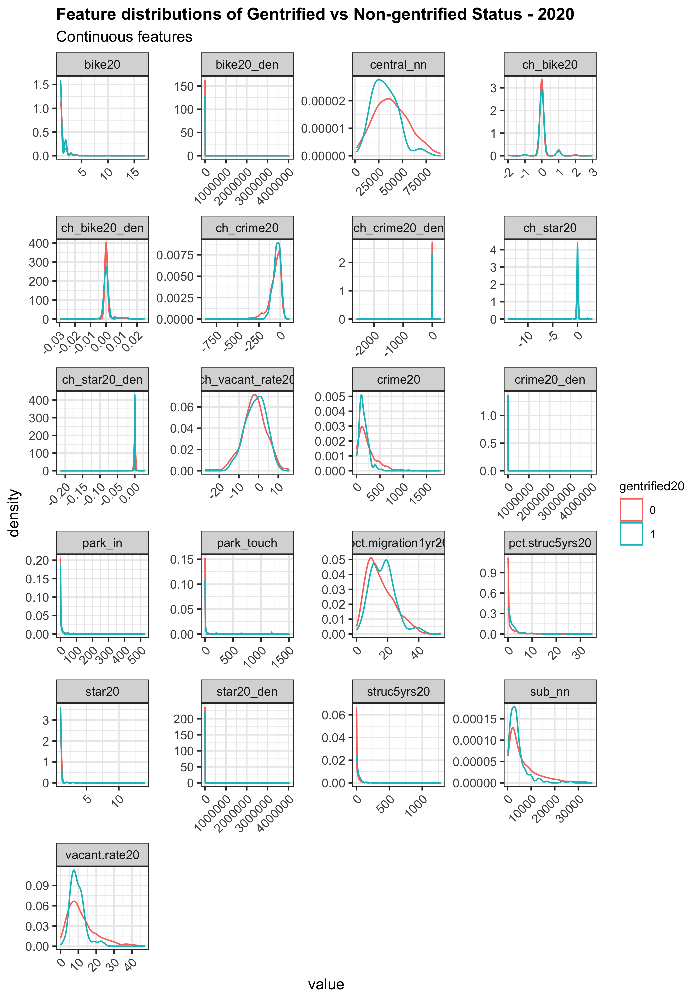<!-- -->

## Log Tranformation

- As shown in the figure, the distribution of some variables becomes more uniform after log transformation; however, a few variables still exhibit a pronounced right skew.


```r
log.var.15 <- c('bike15', 'bike15_den', 'crime15_den', 'pct.struc5yrs15', 'star15', 'star15_den', 'struc5yrs15')

log.var.20 <- c('bike20', 'bike20_den', 'crime20_den', 'pct.struc5yrs20', 'star20', 'star20_den', 'struc5yrs20')

log.var.both <- c('park_in', 'park_touch')

# inspect the range 
# when min = 0 & range >10 -> add 1 in log
# when min = 0 & range <10 -> add 0.1 in log
# make two adding number consistent
# attention: most have a very small value, e.g. 0.0000001
full.dat.log<- full.dat %>%
            st_drop_geometry() %>%
            select(all_of(log.var.15), all_of(log.var.20), all_of(log.var.both))%>%
            na.omit()

# transform data
full.dat <- full.dat %>%
  mutate(log.bike15 = log(bike15),
         log.bike15_den = log(bike15_den),
         log.crime15_den = log(crime15_den),
         log.pct.struc5yrs15 = log(pct.struc5yrs15 + 0.1),
         log.star15 = log(star15),
         log.star15_den = log(star15_den),
         log.struc5yrs15 = log(struc5yrs15+ 1),
         log.bike20 = log(bike20),
         log.bike20_den = log(bike20_den),
         log.crime20_den = log(crime20_den),
         log.pct.struc5yrs20 = log(pct.struc5yrs20 + 0.1),
         log.star20 = log(star20),
         log.star20_den = log(star20_den),
         log.struc5yrs20 = log(struc5yrs20 +1),
         log.park_in = log(park_in+1),
         log.park_touch = log(park_touch+1))

# 2015
full.dat %>%
  as.data.frame() %>% 
  select(all_of(paste0("log.", log.var.15)), all_of(paste0("log.", log.var.both)), gentrified15) %>%
    filter_all(all_vars(!is.na(.))) %>%
    gather(Variable, value, -gentrified15) %>%
    ggplot() + 
    geom_density(aes(value, color=gentrified15), fill = "transparent") + 
    facet_wrap(~Variable, scales = "free") +
    scale_fill_manual(values = palette2) +
    labs(title = "Logged Feature distributions of Gentrified vs Non-gentrified Status - 2015",
         subtitle = "Continuous features") +
  theme_bw() +
  theme(plot.title = element_text(size = 12, face = "bold")) +
  theme(legend.title = element_text(size = 9),
        legend.text = element_text(size = 8)) +
        theme(axis.text.x = element_text(angle = 45, hjust = 1))
```

<!-- -->

```r
# 2020
full.dat %>%
  as.data.frame() %>% 
  select(all_of(paste0("log.", log.var.20)), all_of(paste0("log.", log.var.both)), gentrified20) %>%
    filter_all(all_vars(!is.na(.))) %>%
    gather(Variable, value, -gentrified20) %>%
    ggplot() + 
    geom_density(aes(value, color=gentrified20), fill = "transparent") + 
    facet_wrap(~Variable, scales = "free") +
    scale_fill_manual(values = palette2) +
    labs(title = "Logged Feature distributions of Gentrified vs Non-gentrified Status - 2020",
         subtitle = "Continuous features") +
  theme_bw() +
  theme(plot.title = element_text(size = 12, face = "bold")) +
  theme(legend.title = element_text(size = 9),
        legend.text = element_text(size = 8)) +
        theme(axis.text.x = element_text(angle = 45, hjust = 1))
```

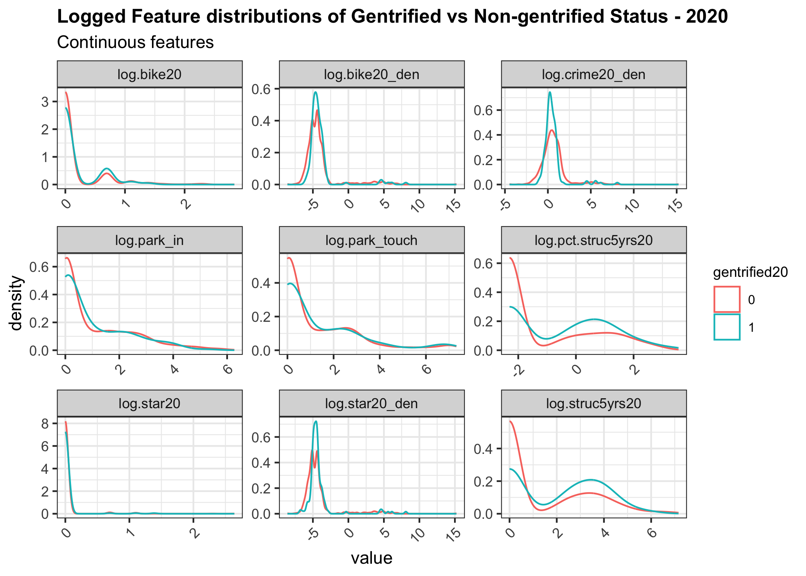<!-- -->

```r
# delete those original variation
full.dat <- full.dat%>%
  select(-all_of(log.var.15), -all_of(log.var.20), -all_of(log.var.both))
```


# Binomial Logistic Model Development Using 2015 Data

**Annotation:** Since K-means clustering is used to distinguish gentrified vs. non-gentrified tracts for both years, we find the most suitable prediction model to be binomial logistic regression ("1" for gentrified census tracts and "0" for non-gentrified census tracts). We acknowledge a potential limitation in that gentrification is classified as a binary condition. However, since K-means clustering is an organic, self-organizing method of classification, we assert that this effect is mitigated to a certain extent.

## Split the Dataset

- Select relevant variables from 2015 to construct the dataset.  
- Split the dataset into training and testing sets with a 50/50 ratio. The splitting process considers the distribution of observations across the combination of the two categorical variables - whether the tract is gentrified and the neighborhood name - to ensure an even distribution.


```r
# Initial variable selection
## Build dataset
dat.mod <- full.dat %>%
  as.data.frame() %>% 
  select(contains("15"), log.park_in, log.park_touch,name, sub_nn, central_nn) %>%
  filter_all(all_vars(!is.na(.))) %>% 
  rename(gentrified = gentrified15,
         crime = crime15,
         ch_crime = ch_crime15,
         log.crime_den = log.crime15_den,
         ch_crime_den = ch_crime15_den,
         log.star = log.star15,
         ch_star = ch_star15,
         log.star_den = log.star15_den,
         ch_star_den = ch_star15_den,
         log.bike = log.bike15,
         ch_bike = ch_bike15,
         log.bike_den = log.bike15_den,
         ch_bike_den = ch_bike15_den,
         log.struc5yrs = log.struc5yrs15,
         log.pct.struc5yrs = log.pct.struc5yrs15,
         pct.migration1yr = pct.migration1yr15,
         vacant.rate = vacant.rate15,
         ch_vacant_rate = ch_vacant_rate15,
         inc_level = inc_level15,
         edu_level = edu_level15,
         dom_white = dom_white15,
         dom_hispanic = dom_hispanic15)
#must rename to remove year number, so the model can be used for another year

dat.mod$gentrified <- relevel(as.factor(dat.mod$gentrified), ref = "0")

## Split dataset
set.seed(5) #please change

trainIndex <- createDataPartition(
   y = paste(dat.mod$gentrified, 
             dat.mod$name), #must include this or code will return error
   p = .50, list = FALSE, times = 1)

dat.train <- dat.mod[trainIndex,]
dat.test  <- dat.mod[-trainIndex,]

dat.train$gentrified <- relevel(as.factor(dat.train$gentrified), ref = "0")

dat.test$gentrified <- relevel(as.factor(dat.test$gentrified), ref = "0")
```

## Variable Selection

- The selection of variables consists of three main steps:  
  + Use a correlation test with a threshold of 0.6 to identify potential collinearity between variables. Construct `mod0` as the baseline model using variables that do not show high correlation with any other variables.
  + Use the AUC (Area Under the Curve) as the criterion for model selection. Apply a backward variable selection method to `mod0`, which involves removing each variable one by one. If the model's AUC increases after removing a variable, that variable is excluded; if the AUC decreases, the variable is retained.
  + Again using AUC as the criterion, apply a forward selection method to add variables that showed collinearity. Each collinear variable is added to the model one by one, and variables that increase the AUC are retained. If multiple variables from a group of collinear variables increase the AUC, the variable that results in the highest AUC increase is selected.

### Correlation Test

- Avoid selecting variables for cross-validation.
  + inc_level
  + edu_level
  + dom_white
  + dom_hispanic
  + name

- The combinations of variables with strong collinearity, selected using a threshold of 0.6, are as follows:
  + log.bike_den / log.star_den / log.crime_den
  + log.pct.struc5yrs / log.struc5yrs
  + log.park_in / log.park_touch
  + ch_star / ch_star_den / log.star
  + ch_bike / ch_bike_den / log.bike
  + central_nn / sub_nn


```r
numericVars <- dat.train %>%
  select_if(is.numeric) %>%  # Select only numeric variables
  na.omit()  # Remove rows with missing values

ggpairs(numericVars)
```

<!-- -->

### Baseline Model Variable Selection

- Include all uncorrelated variables in `mod0`, and then delete one variable at a time to test the AUC. If the AUC increases, delete the variable; otherwise, keep it.  
- Ultimately, the variable "ch_vacant_rate" is removed, increasing the baseline model's AUC from 0.7288 to 0.7319.


```r
# initial model with uncorreltated variables
## all intial variable
mod0 <- glm(gentrified ~ crime + ch_crime + ch_crime_den + vacant.rate + pct.migration1yr + ch_vacant_rate,
                 data = dat.train,
                 na.action = na.exclude,
                 family = binomial("logit"))
testProbs <- data.frame(Outcome = as.factor(dat.test$gentrified),
                        Probs = predict(mod0, dat.test, type= "response"))
pROC::auc(testProbs$Outcome, testProbs$Probs) # 0.7288

# AUC: 0.7228
# delete process- > delete ch_vacant_rate
## crime -> decrease
mod0.1 <- glm(gentrified ~ ch_crime + ch_crime_den + vacant.rate + pct.migration1yr + ch_vacant_rate,
                 data = dat.train,
                 na.action = na.exclude,
                 family = binomial("logit"))
testProbs <- data.frame(Outcome = as.factor(dat.test$gentrified),
                        Probs = predict(mod0.1, dat.test, type= "response"))
pROC::auc(testProbs$Outcome, testProbs$Probs) # 0.7088
## -ch_crime -> decrease
mod0.2 <- glm(gentrified ~ crime + ch_crime_den + vacant.rate + pct.migration1yr + ch_vacant_rate,
                 data = dat.train,
                 na.action = na.exclude,
                 family = binomial("logit"))
testProbs <- data.frame(Outcome = as.factor(dat.test$gentrified),
                        Probs = predict(mod0.2, dat.test, type= "response"))
pROC::auc(testProbs$Outcome, testProbs$Probs) # 0.7123
## -ch_crime_den -> increase
mod0.2 <- glm(gentrified ~ crime + ch_crime + vacant.rate + pct.migration1yr + ch_vacant_rate,
                 data = dat.train,
                 na.action = na.exclude,
                 family = binomial("logit"))
testProbs <- data.frame(Outcome = as.factor(dat.test$gentrified),
                        Probs = predict(mod0.2, dat.test, type= "response"))
pROC::auc(testProbs$Outcome, testProbs$Probs) # 0.7292
## -vacant.rate -> decrease
mod0.2 <- glm(gentrified ~ crime + ch_crime + ch_crime_den + pct.migration1yr + ch_vacant_rate,
                 data = dat.train,
                 na.action = na.exclude,
                 family = binomial("logit"))
testProbs <- data.frame(Outcome = as.factor(dat.test$gentrified),
                        Probs = predict(mod0.2, dat.test, type= "response"))
pROC::auc(testProbs$Outcome, testProbs$Probs) # 0.7114
## -pct.migration1yr -> decrease
mod0.3 <- glm(gentrified ~ crime + ch_crime + ch_crime_den + vacant.rate + ch_vacant_rate,
                 data = dat.train,
                 na.action = na.exclude,
                 family = binomial("logit"))
testProbs <- data.frame(Outcome = as.factor(dat.test$gentrified),
                        Probs = predict(mod0.3, dat.test, type= "response"))
pROC::auc(testProbs$Outcome, testProbs$Probs) # 0.6841
## -ch_vacant_rate -> increase
mod0.4 <- glm(gentrified ~ crime + ch_crime + ch_crime_den + vacant.rate + pct.migration1yr,
                 data = dat.train,
                 na.action = na.exclude,
                 family = binomial("logit"))
testProbs <- data.frame(Outcome = as.factor(dat.test$gentrified),
                        Probs = predict(mod0.4, dat.test, type= "response"))
pROC::auc(testProbs$Outcome, testProbs$Probs) # 0.7319
```

### Avoid Multicollinearity Variable Selection

- Add one variable at a time from each pair with a high correlation value over 0.6. Ultimately, keep the variable that improves the model the most.
- log.bike_den / log.star_den / log.crime_den -> log.star_den
  + The AUC increases from 0.7319 to 0.7382.
- log.pct.struc5yrs / log.struc5yrs -> None
- log.park_in / log.park_touch -> None
- ch_star / ch_star_den / log.star -> None
- ch_bike / ch_bike_den / log.bike -> None
- central_nn / sub_nn -> sub_nn
  + The AUC increases from 0.7382 to 0.7553.


```r
# AUC: 0.7319
# choose1: log.bike_den / log.star_den / log.crime_den -> log.star_den
## log.bike_den -> increase
mod1.1 <- glm(gentrified ~ crime + ch_crime + ch_crime_den + vacant.rate + pct.migration1yr + log.bike_den,
                 data = dat.train,
                 na.action = na.exclude,
                 family = binomial("logit"))
testProbs <- data.frame(Outcome = as.factor(dat.test$gentrified),
                        Probs = predict(mod1.1, dat.test, type= "response"))
pROC::auc(testProbs$Outcome, testProbs$Probs) # 0.7341
## log.star_den -> increase
mod1.2 <- glm(gentrified ~ crime + ch_crime + ch_crime_den + vacant.rate + pct.migration1yr + log.star_den,
                 data = dat.train,
                 na.action = na.exclude,
                 family = binomial("logit"))
testProbs <- data.frame(Outcome = as.factor(dat.test$gentrified),
                        Probs = predict(mod1.2, dat.test, type= "response"))
pROC::auc(testProbs$Outcome, testProbs$Probs) # 0.7382
## log.crime_den -> decrease
mod1.3 <- glm(gentrified ~ crime + ch_crime + ch_crime_den + vacant.rate + pct.migration1yr + log.crime_den,
                 data = dat.train,
                 na.action = na.exclude,
                 family = binomial("logit"))
testProbs <- data.frame(Outcome = as.factor(dat.test$gentrified),
                        Probs = predict(mod1.3, dat.test, type= "response"))
pROC::auc(testProbs$Outcome, testProbs$Probs) # 0.7297


# AUC: 0.7382
#choose2: log.pct.struc5yrs / log.struc5yrs -> None
## log.pct.struc5yrs -> decrease
mod2.1 <- glm(gentrified ~ crime + ch_crime + ch_crime_den + vacant.rate + pct.migration1yr + log.star_den + log.pct.struc5yrs,
                 data = dat.train,
                 na.action = na.exclude,
                 family = binomial("logit"))
testProbs <- data.frame(Outcome = as.factor(dat.test$gentrified),
                        Probs = predict(mod2.1, dat.test, type= "response"))
pROC::auc(testProbs$Outcome, testProbs$Probs) # 0.7382
## log.struc5yrs -> decrease
mod2.2 <- glm(gentrified ~ crime + ch_crime + ch_crime_den + vacant.rate + pct.migration1yr + log.star_den + log.struc5yrs,
                 data = dat.train,
                 na.action = na.exclude,
                 family = binomial("logit"))
testProbs <- data.frame(Outcome = as.factor(dat.test$gentrified),
                        Probs = predict(mod2.2, dat.test, type= "response"))
pROC::auc(testProbs$Outcome, testProbs$Probs) # 0.737


# AUC: 0.7382
# choose3: log.park_in / log.park_touch -> None
## log.park_in -> decrease
mod3.1 <- glm(gentrified ~ crime + ch_crime + ch_crime_den + vacant.rate + pct.migration1yr + log.star_den + log.park_in,
                 data = dat.train,
                 na.action = na.exclude,
                 family = binomial("logit"))
testProbs <- data.frame(Outcome = as.factor(dat.test$gentrified),
                        Probs = predict(mod3.1, dat.test, type= "response"))
pROC::auc(testProbs$Outcome, testProbs$Probs) # 0.7357
## log.park_touch -> decrease
mod3.2 <- glm(gentrified ~ crime + ch_crime + ch_crime_den + vacant.rate + pct.migration1yr + log.star_den + log.park_touch,
                 data = dat.train,
                 na.action = na.exclude,
                 family = binomial("logit"))
testProbs <- data.frame(Outcome = as.factor(dat.test$gentrified),
                        Probs = predict(mod3.2, dat.test, type= "response"))
pROC::auc(testProbs$Outcome, testProbs$Probs) # 0.7338


# AUC: 0.7382
# choose4: ch_star / ch_star_den / log.star -> None
## ch_star -> decrease
mod4.1 <- glm(gentrified ~ crime + ch_crime + ch_crime_den + vacant.rate + pct.migration1yr + log.star_den + ch_star,
                 data = dat.train,
                 na.action = na.exclude,
                 family = binomial("logit"))
testProbs <- data.frame(Outcome = as.factor(dat.test$gentrified),
                        Probs = predict(mod4.1, dat.test, type= "response"))
pROC::auc(testProbs$Outcome, testProbs$Probs) # 0.7322
## ch_star_den -> decrease
mod4.2 <- glm(gentrified ~ crime + ch_crime + ch_crime_den + vacant.rate + pct.migration1yr + log.star_den + ch_star_den,
                 data = dat.train,
                 na.action = na.exclude,
                 family = binomial("logit"))
testProbs <- data.frame(Outcome = as.factor(dat.test$gentrified),
                        Probs = predict(mod4.2, dat.test, type= "response"))
pROC::auc(testProbs$Outcome, testProbs$Probs) # 0.7369

## log.star -> decrease
mod4.3 <- glm(gentrified ~ crime + ch_crime + ch_crime_den + vacant.rate + pct.migration1yr + log.star_den + log.star,
                 data = dat.train,
                 na.action = na.exclude,
                 family = binomial("logit"))
testProbs <- data.frame(Outcome = as.factor(dat.test$gentrified),
                        Probs = predict(mod4.3, dat.test, type= "response"))
pROC::auc(testProbs$Outcome, testProbs$Probs) # 0.7317


# AUC: 0.7382
# choose6: ch_bike / ch_bike_den / log.bike -> None
## ch_bike -> decrease
mod5.1 <- glm(gentrified ~ crime + ch_crime + ch_crime_den + vacant.rate + pct.migration1yr + log.star_den + ch_bike,
                 data = dat.train,
                 na.action = na.exclude,
                 family = binomial("logit"))
testProbs <- data.frame(Outcome = as.factor(dat.test$gentrified),
                        Probs = predict(mod5.1, dat.test, type= "response"))
pROC::auc(testProbs$Outcome, testProbs$Probs) # 0.7114
## ch_bike_den -> decrease
mod5.2 <- glm(gentrified ~ crime + ch_crime + ch_crime_den + vacant.rate + pct.migration1yr + log.star_den + ch_bike_den,
                 data = dat.train,
                 na.action = na.exclude,
                 family = binomial("logit"))
testProbs <- data.frame(Outcome = as.factor(dat.test$gentrified),
                        Probs = predict(mod5.2, dat.test, type= "response"))
pROC::auc(testProbs$Outcome, testProbs$Probs) # 0.7307
## log.bike -> decrease
mod5.3 <- glm(gentrified ~ crime + ch_crime + ch_crime_den + vacant.rate + pct.migration1yr + log.star_den + log.bike,
                 data = dat.train,
                 na.action = na.exclude,
                 family = binomial("logit"))
testProbs <- data.frame(Outcome = as.factor(dat.test$gentrified),
                        Probs = predict(mod5.3, dat.test, type= "response"))
pROC::auc(testProbs$Outcome, testProbs$Probs) # 0.7249


# AUC: 0.7382
# choose6: - central_nn / sub_nn -> sub_nn
## central_nn -> decrease
mod6.1 <- glm(gentrified ~ crime + ch_crime + ch_crime_den + vacant.rate + pct.migration1yr + log.star_den + central_nn,
                 data = dat.train,
                 na.action = na.exclude,
                 family = binomial("logit"))
testProbs <- data.frame(Outcome = as.factor(dat.test$gentrified),
                        Probs = predict(mod6.1, dat.test, type= "response"))
pROC::auc(testProbs$Outcome, testProbs$Probs) # 0.7391
## sub_nn -> increase
mod6.2 <- glm(gentrified ~ crime + ch_crime + ch_crime_den + vacant.rate + pct.migration1yr + log.star_den + sub_nn,
                 data = dat.train,
                 na.action = na.exclude,
                 family = binomial("logit"))
testProbs <- data.frame(Outcome = as.factor(dat.test$gentrified),
                        Probs = predict(mod6.2, dat.test, type= "response"))
pROC::auc(testProbs$Outcome, testProbs$Probs) # 0.7553
```

## Final Model

- The final prediction model, based on 2015 data, includes the variables "crime," "ch_crime," "ch_crime_den," "vacant.rate," "pct.migration1yr," "log.star_den," and "sub_nn."


```r
# Model results
final.mod <- glm(gentrified ~ crime + ch_crime + ch_crime_den + vacant.rate + pct.migration1yr + log.star_den + sub_nn,
                 data = dat.train,
                 na.action = na.exclude,
                 family = binomial("logit"))

testProbs <- data.frame(Outcome = as.factor(dat.test$gentrified),
                        Probs = predict(final.mod, dat.test, type= "response"))
```

### ROC Curve for 2015

- We then plot the Receiver Operating Characteristic (ROC) curve below to visualize the overall model performance as well as the performance at each probability threshold.
- The ROC curve lies above the y=x line with an area under the curve (AUC) of 0.7553, indicating that the model performs significantly better than a coin flip.


```r
# plot ROC Curve
ggplot(testProbs, aes(d = as.numeric(Outcome), m = Probs)) +
  geom_roc(n.cuts = 50, labels = T, colour = "#FE9900") +
  style_roc(theme = theme_grey) +
  geom_abline(slope = 1, intercept = 0, size = 1.5, color = 'grey') +
  labs(title = "ROC Curve - clickModel") +
   theme_bw() +
  theme(plot.title = element_text(size = 12, face = "bold")) +
  theme(legend.title = element_text(size = 9),
        legend.text = element_text(size = 8)) +
        theme(axis.text.x = element_text(angle = 45, hjust = 1))
```

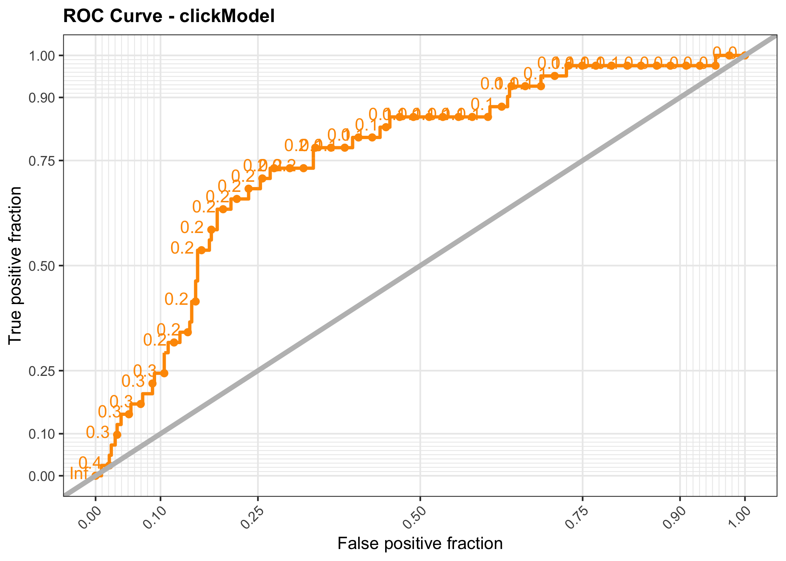<!-- -->

### Choose Threshold

- To balance the sensitivity and specificity of the prediction model, we refer to the intersection of the two curves in the figure below. We test the confusion matrix with thresholds ranging from 0.12 to 0.20, ultimately choosing **0.18** as the final threshold for the prediction model. At this threshold, the model performs well in terms of both sensitivity and specificity.


```r
# function from the book
iterateThresholds <- function(data, observedClass, predictedProbs, group) {
  observedClass <- enquo(observedClass)
  predictedProbs <- enquo(predictedProbs)
  group <- enquo(group)
  x = .01
  all_prediction <- data.frame()
  
  if (missing(group)) {
  
    while (x <= 1) {
    this_prediction <- data.frame()
    
    this_prediction <-
      data %>%
      mutate(predclass = ifelse(!!predictedProbs > x, 1,0)) %>%
      count(predclass, !!observedClass) %>%
      summarize(Count_TN = sum(n[predclass==0 & !!observedClass==0]),
                Count_TP = sum(n[predclass==1 & !!observedClass==1]),
                Count_FN = sum(n[predclass==0 & !!observedClass==1]),
                Count_FP = sum(n[predclass==1 & !!observedClass==0]),
                Rate_TP = Count_TP / (Count_TP + Count_FN),
                Rate_FP = Count_FP / (Count_FP + Count_TN),
                Rate_FN = Count_FN / (Count_FN + Count_TP),
                Rate_TN = Count_TN / (Count_TN + Count_FP),
                Accuracy = (Count_TP + Count_TN) / 
                           (Count_TP + Count_TN + Count_FN + Count_FP)) %>%
      mutate(Threshold = round(x,2))
    
    all_prediction <- rbind(all_prediction,this_prediction)
    x <- x + .01
  }
  return(all_prediction)
  }
  else if (!missing(group)) { 
   while (x <= 1) {
    this_prediction <- data.frame()
    
    this_prediction <-
      data %>%
      mutate(predclass = ifelse(!!predictedProbs > x, 1,0)) %>%
      group_by(!!group) %>%
      count(predclass, !!observedClass) %>%
      summarize(Count_TN = sum(n[predclass==0 & !!observedClass==0]),
                Count_TP = sum(n[predclass==1 & !!observedClass==1]),
                Count_FN = sum(n[predclass==0 & !!observedClass==1]),
                Count_FP = sum(n[predclass==1 & !!observedClass==0]),
                Rate_TP = Count_TP / (Count_TP + Count_FN),
                Rate_FP = Count_FP / (Count_FP + Count_TN),
                Rate_FN = Count_FN / (Count_FN + Count_TP),
                Rate_TN = Count_TN / (Count_TN + Count_FP),
                Accuracy = (Count_TP + Count_TN) / 
                           (Count_TP + Count_TN + Count_FN + Count_FP)) %>%
      mutate(Threshold = round(x, 2))
    
    all_prediction <- rbind(all_prediction, this_prediction)
    x <- x + .01
  }
  return(all_prediction)
  }
}

# choose the threshold: 
# a better one: sensitivity increase > specificity decrease
whichThreshold <- 
  iterateThresholds(data=testProbs, observedClass = Outcome, predictedProbs = Probs)%>%
  dplyr::select(Rate_TP, Rate_TN, Threshold)%>%
  rename(Sensitivity = Rate_TP, Specificity = Rate_TN)

#plot sensitivity and specificity -> both have relative high value
# Sensitivity = 0.8156028 Specificity = 0.81850534 Threshold = 0.27
whichThreshold %>%
  select(Sensitivity, Specificity, Threshold)%>%
  gather(Variable, Rate, -Threshold) %>%
  ggplot(.,aes(Threshold, Rate, colour = Variable)) +
  geom_point() +
  scale_colour_manual(values = palette2) +    
  labs(title = "Specificity and Sensitivity by threshold",
       y = "Rate") +
  guides(colour=guide_legend(title = "Rate"))+
        theme_bw() +
  theme(plot.title = element_text(size = 12, face = "bold")) +
  theme(legend.title = element_text(size = 9),
        legend.text = element_text(size = 8)) +
        theme(axis.text.x = element_text(angle = 45, hjust = 1)) 
```

<!-- -->

### Confusion Matrix for 2015

- The confusion matrix at **threshold = 0.18** is shown below:
  + True Positive: 73.17% (30 gentrified neighborhoods are predicted to be gentrified)
  + False Positive: 26.89% (89 non-gentrified neighborhoods are incorrectly predicted to be gentrified)
  + True Negative: 73.11% (242 non-gentrified neighborhoods are predicted to be non-gentrified)
  + False Negative: 26.83% (11 gentrified neighborhoods are incorrectly predicted to be non-gentrified)


```r
testProbs <- 
  testProbs %>%
  mutate(predOutcome  = as.factor(ifelse(testProbs$Probs > 0.18 , 1, 0)))

conf_matrix <- table(observed = testProbs$Outcome, predicted = testProbs$predOutcome)

conf_matrix

100 * prop.table(table(Observed = testProbs$Outcome, Predicted = testProbs$predOutcome), margin = 1)
```

### Summary of Model Results

- The summary table of model results is shown below:
  + The model proposes key takeaways, including negative associations between crime counts or increasing crimes with gentrification, and positive associations between positive home seeker trends, represented by lower vacancy rates and higher in-migration rates, with gentrification.
  + The model also implies that tracts located in better-developed areas, represented by higher Starbucks density or proximity to transit stations, are more resistant to intensive upgrading and gentrification.


```r
model_summary <- summary(final.mod)$coefficients

model_df <- as.data.frame(model_summary)

# Manually add stars to coefficients based on p-values

model_df$Significance <- ifelse(model_summary[,4] < 0.001, "***",                           
                          ifelse(model_summary[,4] < 0.01, "**",                           
                                 ifelse(model_summary[,4] < 0.05, "*", "")))

# Combine Estimate and Significance into a single column for aesthetic purposes
model_df$Estimate <- paste0(sprintf("%.3f", model_df$Estimate), 
                            model_df$Significance)

# Now use kable to create the table
kable(model_df[, -5], format = "html", digits = 3, caption = "Summary of Final Model") %>%  
  kable_styling(bootstrap_options = c("striped", "hover", "condensed"), full_width = F) %>%  
  column_spec(1, bold = T) %>%
  column_spec(1:5, extra_css = "text-align: left;")
```

<table class="table table-striped table-hover table-condensed" style="color: black; width: auto !important; margin-left: auto; margin-right: auto;">
<caption>Summary of Final Model</caption>
 <thead>
  <tr>
   <th style="text-align:left;">   </th>
   <th style="text-align:left;"> Estimate </th>
   <th style="text-align:right;"> Std. Error </th>
   <th style="text-align:right;"> z value </th>
   <th style="text-align:right;"> Pr(&gt;|z|) </th>
  </tr>
 </thead>
<tbody>
  <tr>
   <td style="text-align:left;font-weight: bold;text-align: left;"> (Intercept) </td>
   <td style="text-align:left;text-align: left;"> -1.148* </td>
   <td style="text-align:right;text-align: left;"> 0.539 </td>
   <td style="text-align:right;text-align: left;"> -2.129 </td>
   <td style="text-align:right;text-align: left;"> 0.033 </td>
  </tr>
  <tr>
   <td style="text-align:left;font-weight: bold;text-align: left;"> crime </td>
   <td style="text-align:left;text-align: left;"> -0.004** </td>
   <td style="text-align:right;text-align: left;"> 0.001 </td>
   <td style="text-align:right;text-align: left;"> -3.026 </td>
   <td style="text-align:right;text-align: left;"> 0.002 </td>
  </tr>
  <tr>
   <td style="text-align:left;font-weight: bold;text-align: left;"> ch_crime </td>
   <td style="text-align:left;text-align: left;"> -0.004* </td>
   <td style="text-align:right;text-align: left;"> 0.002 </td>
   <td style="text-align:right;text-align: left;"> -2.142 </td>
   <td style="text-align:right;text-align: left;"> 0.032 </td>
  </tr>
  <tr>
   <td style="text-align:left;font-weight: bold;text-align: left;"> ch_crime_den </td>
   <td style="text-align:left;text-align: left;"> 0.001 </td>
   <td style="text-align:right;text-align: left;"> 0.002 </td>
   <td style="text-align:right;text-align: left;"> 0.381 </td>
   <td style="text-align:right;text-align: left;"> 0.703 </td>
  </tr>
  <tr>
   <td style="text-align:left;font-weight: bold;text-align: left;"> vacant.rate </td>
   <td style="text-align:left;text-align: left;"> -0.035 </td>
   <td style="text-align:right;text-align: left;"> 0.022 </td>
   <td style="text-align:right;text-align: left;"> -1.555 </td>
   <td style="text-align:right;text-align: left;"> 0.120 </td>
  </tr>
  <tr>
   <td style="text-align:left;font-weight: bold;text-align: left;"> pct.migration1yr </td>
   <td style="text-align:left;text-align: left;"> 0.031* </td>
   <td style="text-align:right;text-align: left;"> 0.015 </td>
   <td style="text-align:right;text-align: left;"> 2.078 </td>
   <td style="text-align:right;text-align: left;"> 0.038 </td>
  </tr>
  <tr>
   <td style="text-align:left;font-weight: bold;text-align: left;"> log.star_den </td>
   <td style="text-align:left;text-align: left;"> -0.016 </td>
   <td style="text-align:right;text-align: left;"> 0.074 </td>
   <td style="text-align:right;text-align: left;"> -0.212 </td>
   <td style="text-align:right;text-align: left;"> 0.832 </td>
  </tr>
  <tr>
   <td style="text-align:left;font-weight: bold;text-align: left;"> sub_nn </td>
   <td style="text-align:left;text-align: left;"> -0.000 </td>
   <td style="text-align:right;text-align: left;"> 0.000 </td>
   <td style="text-align:right;text-align: left;"> -1.526 </td>
   <td style="text-align:right;text-align: left;"> 0.127 </td>
  </tr>
</tbody>
</table>


# 2015 Model Testing

**Annotation:** To test how the model performs across different census tracts with diverse characteristics, this section includes spatial validation and socioeconomic validation. For spatial validation, we plot the confusion matrix for different neighborhoods. For socioeconomic validation, we plot the confusion matrix for census tracts with varying household income levels, education levels, predominantly white populations, and predominantly Hispanic populations.

## CV across Different Neighborhoods

- Fitting the model to Chicago’s neighborhoods in 2015 (test set), we find that the model performs best at predicting gentrification in Chicago neighborhoods like Logan Square, Garfield Park, Lake View, and Pilsen.  
- However, we note that these neighborhoods with high true gentrification prediction rates are also prone to having higher false gentrification predictions.  
- Additionally, the model captures non-gentrified areas particularly well but underestimates several gentrifying neighborhoods like Portage Park and Goose Island.


```r
#cross validation across neighborhoods
testProbs2 <- 
  data.frame(class = as.numeric(as.character(dat.test$gentrified)),
             probs = predict(final.mod, dat.test, type = "response"),
             Neighborhood = dat.test$name)

testProbs.thresholds2 <- 
  iterateThresholds(data = testProbs2, observedClass = class, 
                    predictedProbs = probs, group = Neighborhood)

#create a table to understand the rates across neighborhoods?

map_testProbs.thresholds2 <- testProbs.thresholds2 %>% 
  filter(Threshold == 0.18) %>% 
  group_by(Neighborhood) %>% 
  summarize(Rate_TP = mean(Rate_TP),
            Rate_FP = mean(Rate_FP),
            Rate_FN = mean(Rate_FN),
            Rate_TN = mean(Rate_TN))
  
map_testProbs.thresholds2[is.na(map_testProbs.thresholds2)] <- 0

# map
map_testProbs.thresholds2 %>%
  gather(Variable, value, -Neighborhood)%>%
  left_join(full.dat %>% select(name, geometry), 
            by = c('Neighborhood' = 'name'))%>%
  st_as_sf()%>%
  ggplot() +
    geom_sf(aes(fill = value)) +
    facet_wrap(~Variable) +
    scale_fill_viridis() +
    labs(title = "Confusion matrix rates by neighborhoods - 2015") +
    mapTheme() + theme(panel.border = element_rect(colour = "black", fill=NA, size=0.6),
                       strip.text.x = element_text(size = 10))
```

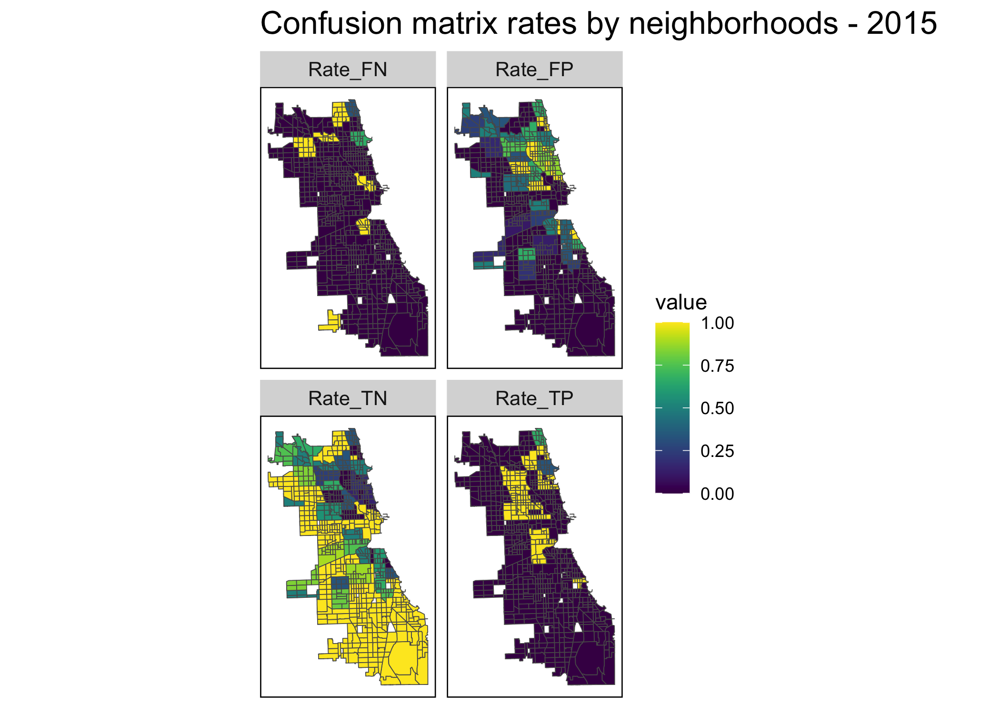<!-- -->

## CV on Different Income Levels

- The true positive rate is highest among tracts in the top 50% of income.  
- The true positive rate is lowest among tracts at the moderate income level (Q2), which is accompanied by the highest false negative rate. This indicates that gentrification may be underpredicted in those areas, even though they may continue to face an influx of affluent home seekers and competition for housing and resources.  
- The true negative rate is highest among tracts at the low income level, likely representing traditionally marginalized neighborhoods that are still not receiving adequate investment.  
- The false positive rate is highest among tracts at the highest income level (Q4), indicating that the wealthiest tracts are easily predicted as gentrified neighborhoods.


```r
testProbs3 <- 
  data.frame(class = as.character(dat.test$gentrified),
             probs = predict(final.mod, dat.test, type = "response"),
             income = dat.test$inc_level)

# plot error by income
testProbs.thresholds3 <- 
  iterateThresholds(data=testProbs3, observedClass = class, 
                    predictedProbs = probs, group = income)

filter(testProbs.thresholds3, Threshold == 0.18)  %>%
  dplyr::select(Accuracy, income, starts_with("Rate")) %>%
  gather(Variable, Value, -income) %>%
  ggplot(aes(Variable, Value, fill = income)) +
  geom_bar(aes(fill = income), position = "dodge", stat = "identity",colour = "white") +
  geom_text(aes(label = sprintf("%.2f", Value)),                      # Add labels
            position = position_dodge(width = 0.9), vjust = -0.5, size = 3) +
  scale_fill_manual(values = palette4) +
  labs(title="Confusion matrix rates by income levels - 2015",
       subtitle = "Threshold = 0.18", x = "Outcome",y = "Rate") +
  theme(axis.text.x = element_text(angle = 45, hjust = 1)) +
        theme_bw() +
  theme(plot.title = element_text(size = 12, face = "bold")) +
  theme(legend.title = element_text(size = 9),
        legend.text = element_text(size = 8)) +
        theme(axis.text.x = element_text(angle = 45, hjust = 1))
```

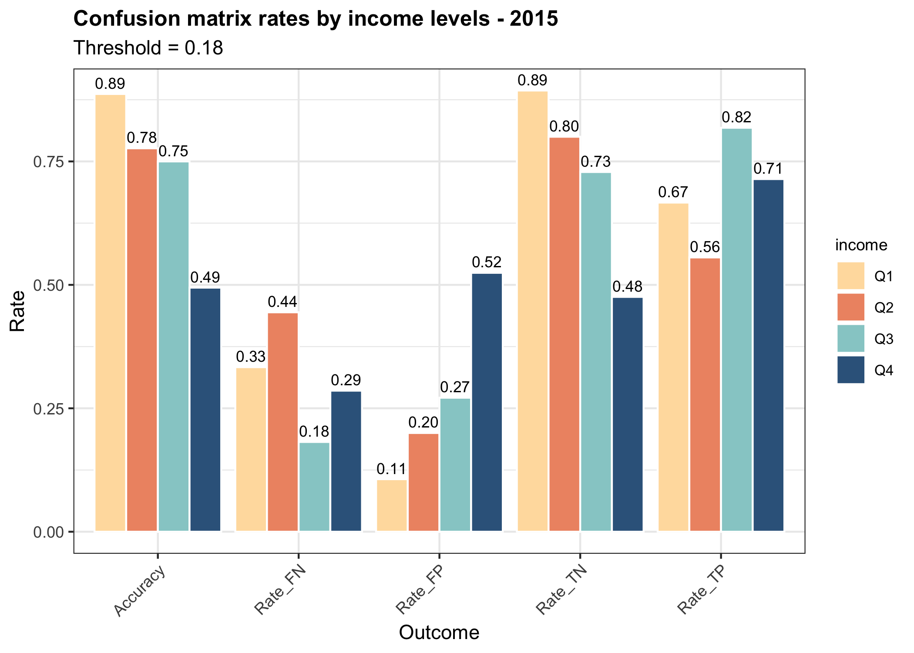<!-- -->

## CV of Different Education Levels

- The true negative rate is highest among tracts with the lowest education level (Q1), which are likely traditionally marginalized neighborhoods still not receiving adequate educational investments.  
- The true positive rate is highest among areas with the highest education level (Q4); however, this is accompanied by the highest false positive rate.


```r
testProbs4 <- 
  data.frame(class = as.character(dat.test$gentrified),
             probs = predict(final.mod, dat.test, type = "response"),
             education = dat.test$edu_level)

# plot error by income
testProbs.thresholds4 <- 
  iterateThresholds(data=testProbs4, observedClass = class, 
                    predictedProbs = probs, group = education)

filter(testProbs.thresholds4, Threshold == 0.18)  %>%
  dplyr::select(Accuracy, education, starts_with("Rate")) %>%
  gather(Variable, Value, -education) %>%
  ggplot(aes(Variable, Value, fill = education)) +
  geom_bar(aes(fill = education), position = "dodge", stat = "identity",colour = "white") +
  geom_text(aes(label = sprintf("%.2f", Value)),                      # Add labels
            position = position_dodge(width = 0.9), vjust = -0.5, size = 3) +
  scale_fill_manual(values = palette4) +
  labs(title="Confusion matrix rates by education levels - 2015",
       subtitle = "Threshold = 0.18", x = "Outcome",y = "Rate") +
  theme(axis.text.x = element_text(angle = 45, hjust = 1)) +
        theme_bw() +
  theme(plot.title = element_text(size = 12, face = "bold")) +
  theme(legend.title = element_text(size = 9),
        legend.text = element_text(size = 8)) +
        theme(axis.text.x = element_text(angle = 45, hjust = 1))
```

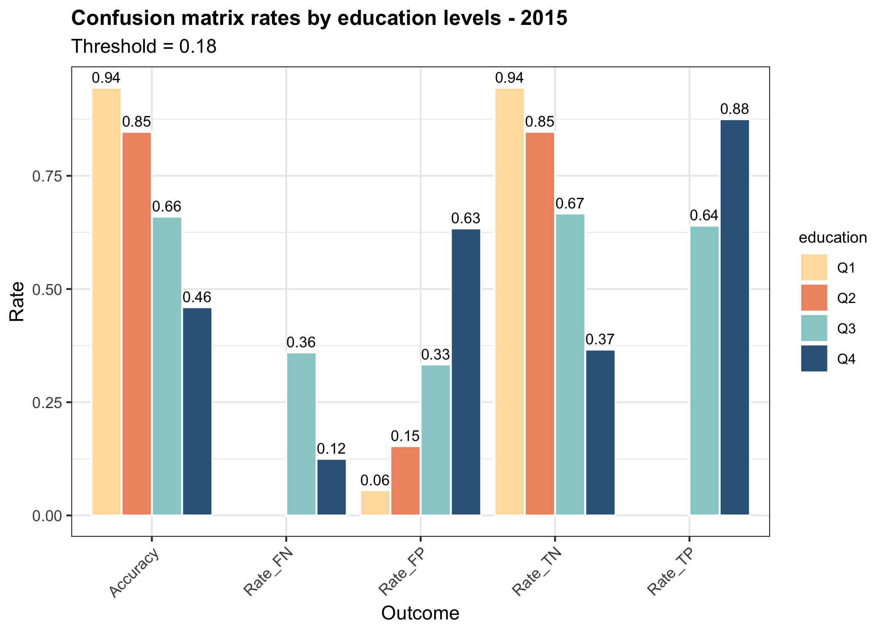<!-- -->

## CV on Different Dominant Races/Ethnicities

- The accuracy rate is higher among non-predominantly white tracts, indicated by a much higher true negative rate and a marginally higher true positive rate.  
- The higher true negative rate may result from the fact that many non-predominantly white areas are associated with lower income and educational attainment.  
- The higher true positive and lower false positive rates across minority-dominant communities have positive implications, such as better identification and intervention for their anti-displacement needs.


```r
#predominantly white or not
testProbs5 <- 
  data.frame(class = as.character(dat.test$gentrified),
             probs = predict(final.mod, dat.test, type = "response"),
             dominant_white = dat.test$dom_white)

## plot error
testProbs.thresholds5 <- 
  iterateThresholds(data=testProbs5, observedClass = class, 
                    predictedProbs = probs, group = dominant_white)

filter(testProbs.thresholds5, Threshold == 0.18)  %>%
  dplyr::select(Accuracy, dominant_white, starts_with("Rate")) %>%
  gather(Variable, Value, -dominant_white) %>%
  ggplot(aes(Variable, Value, fill = dominant_white)) +
  geom_bar(aes(fill = dominant_white), 
           position = "dodge", stat = "identity",colour = "white") +
  geom_text(aes(label = sprintf("%.2f", Value)),                      # Add labels
            position = position_dodge(width = 0.9), vjust = -0.5, size = 3) +
  scale_fill_manual(values = palette2) +
  labs(title="Confusion matrix rates by predominantly white or not - 2015",
       subtitle = "Threshold = 0.18", x = "Outcome",y = "Rate") +
  theme(axis.text.x = element_text(angle = 45, hjust = 1)) +
        theme_bw() +
  theme(plot.title = element_text(size = 12, face = "bold")) +
  theme(legend.title = element_text(size = 9),
        legend.text = element_text(size = 8)) +
        theme(axis.text.x = element_text(angle = 45, hjust = 1))
```

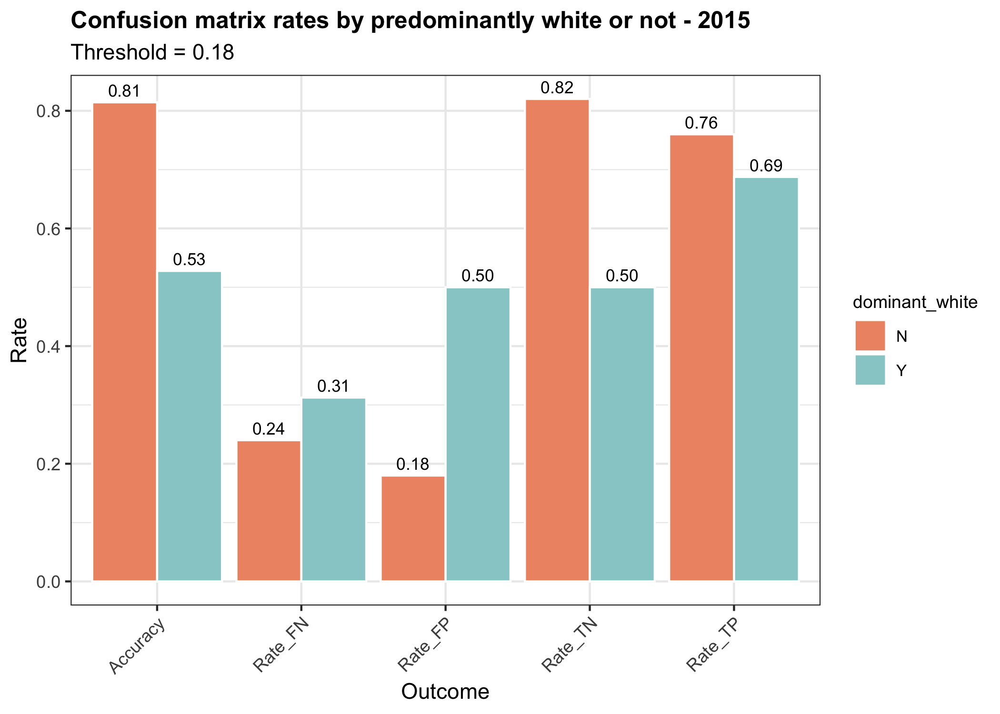<!-- -->

- The results show similar trends to previous cross-validation, indicating that higher accuracy rates, true negative rates, and true positive rates correspond to predominantly Hispanic areas.  
- Higher true positive rates and lower false positive rates across Hispanic-dominant communities have positive implications, such as better identifying and addressing their needs for anti-displacement measures in advance.


```r
#predominantly hispanic or not
testProbs6 <- 
  data.frame(class = as.character(dat.test$gentrified),
             probs = predict(final.mod, dat.test, type = "response"),
             dominant_hispanic = dat.test$dom_hispanic)

# plot error by income
testProbs.thresholds6 <- 
  iterateThresholds(data=testProbs6, observedClass = class, 
                    predictedProbs = probs, group = dominant_hispanic)

filter(testProbs.thresholds6, Threshold == 0.18)  %>%
  dplyr::select(Accuracy, dominant_hispanic, starts_with("Rate")) %>%
  gather(Variable, Value, -dominant_hispanic) %>%
  ggplot(aes(Variable, Value, fill = dominant_hispanic)) +
  geom_bar(aes(fill = dominant_hispanic), 
           position = "dodge", stat = "identity",colour = "white") +
  geom_text(aes(label = sprintf("%.2f", Value)),                      # Add labels
            position = position_dodge(width = 0.9), vjust = -0.5, size = 3) +
  scale_fill_manual(values = palette2) +
  labs(title="Confusion matrix rates by predominantly Hispanic or not - 2015",
       subtitle = "Threshold = 0.18", x = "Outcome",y = "Rate") +
  theme(axis.text.x = element_text(angle = 45, hjust = 1)) +
        theme_bw() +
  theme(plot.title = element_text(size = 12, face = "bold")) +
  theme(legend.title = element_text(size = 9),
        legend.text = element_text(size = 8)) +
        theme(axis.text.x = element_text(angle = 45, hjust = 1))
```

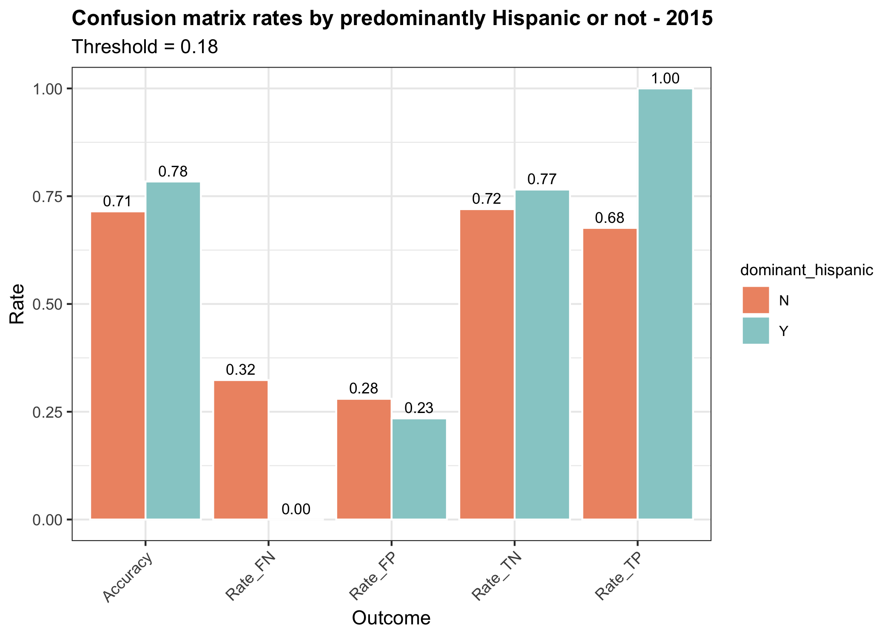<!-- -->

# Cross-Time Validation - 2020 Model Testing

**Annotation:** To test the model's performance across different time periods, we ran the model using the 2020 dataset and conducted both spatial and socioeconomic validation as described above.


```r
dat.mod20 <- full.dat %>%
  as.data.frame() %>% 
  select(contains("20"), log.park_in, log.park_touch, name, sub_nn) %>%
  filter_all(all_vars(!is.na(.))) %>% 
  rename(gentrified = gentrified20,
         crime = crime20,
         ch_crime = ch_crime20,
         log.crime_den = log.crime20_den,
         ch_crime_den = ch_crime20_den,
         log.star = log.star20,
         ch_star = ch_star20,
         log.star_den = log.star20_den,
         ch_star_den = ch_star20_den,
         log.bike = log.bike20,
         ch_bike = ch_bike20,
         log.bike_den = log.bike20_den,
         ch_bike_den = ch_bike20_den,
         log.struc5yrs = log.struc5yrs20,
         log.pct.struc5yrs = log.pct.struc5yrs20,
         pct.migration1yr = pct.migration1yr20,
         vacant.rate = vacant.rate20,
         ch_vacant_rate = ch_vacant_rate20,
         inc_level = inc_level20,
         edu_level = edu_level20,
         dom_white = dom_white20,
         dom_hispanic = dom_hispanic20)
  
dat.mod20$gentrified <- relevel(as.factor(dat.mod20$gentrified), ref = "0")

#dont need to split dataset since using model directly for testing
```

## ROC Curve for 2020

- We also plot the Receiver Operating Characteristic (ROC) curve for 2020 to visualize the overall model performance as well as the performance at each probability threshold.
- The ROC curve lies above the y=x line with an area under the curve (AUC) of 0.6747, indicating that the model performs significantly better than a coin flip. However, the model's performance on the 2020 data is noticeably weaker compared to the 2015 data.


```r
testProbs20 <- data.frame(Outcome = as.factor(dat.mod20$gentrified),
                        Probs = predict(final.mod, dat.mod20, type= "response"))### Test probabilities


pROC::auc(testProbs20$Outcome, testProbs20$Probs) # 0.6747

ggplot(testProbs20, aes(d = as.numeric(Outcome), m = Probs)) +
  geom_roc(n.cuts = 50, labels = T, labelsize = 3,labelround = 2,colour = "#FE9900") +
  style_roc(theme = theme_grey) +
  geom_abline(slope = 1, intercept = 0, size = 1.5, color = 'grey') +
  labs(title = "ROC Curve") +
    theme_bw() +
  theme(plot.title = element_text(size = 12, face = "bold")) +
  theme(legend.title = element_text(size = 9),
        legend.text = element_text(size = 8)) +
        theme(axis.text.x = element_text(angle = 45, hjust = 1))
```

<!-- -->

## Confusion Matrix for 2020

- The confusion matrix at **threshold = 0.15** is shown below:  
  + True Positive: 68.61% (94 gentrified neighborhoods are predicted to be gentrified)  
  + False Positive: 37.06% (252 non-gentrified neighborhoods are incorrectly predicted to be gentrified)  
  + True Negative: 62.94% (428 non-gentrified neighborhoods are predicted to be non-gentrified)  
  + False Negative: 31.39% (43 gentrified neighborhoods are incorrectly predicted to be non-gentrified)  


```r
testProbs20 <- 
  testProbs20 %>%
  mutate(predOutcome  = as.factor(ifelse(testProbs20$Probs >= 0.15 , 1, 0)))

conf_matrix20 <- table(observed = testProbs20$Outcome, predicted = testProbs20$predOutcome)

conf_matrix20

100 * prop.table(table(Observed = testProbs20$Outcome, Predicted = testProbs20$predOutcome), margin = 1)
```

## CV across Different Neighborhoods

- When predicting for 2020 gentrification outcomes, it is observed that the highest correct rate for predicting true gentrifications is still concentrated in Chicago’s north and west end such as Lincoln Square and Austin, signaling a new trend of gentrification expanding further up-north and west.   
- However, north-end and west-end Chicago continues to receive higher misclassification as gentrified.  
- The model also performs worse at distinguishing non-gentrified tracts, except for South Chicago.  


```r
#cross validation across neighborhoods
testProbs2.20 <- 
  data.frame(class = as.numeric(as.character(dat.mod20$gentrified)),
             probs = predict(final.mod, dat.mod20, type = "response"),
             Neighborhood = dat.mod20$name)

testProbs.thresholds2.20 <- 
  iterateThresholds(data=testProbs2.20, observedClass = class, 
                    predictedProbs = probs, group = Neighborhood)

map_testProbs.thresholds2.20 <- testProbs.thresholds2.20 %>% 
  filter(Threshold == 0.15) %>% 
  group_by(Neighborhood) %>% 
  summarize(Rate_TP = mean(Rate_TP),
            Rate_FP = mean(Rate_FP),
            Rate_FN = mean(Rate_FN),
            Rate_TN = mean(Rate_TN))

# map
map_testProbs.thresholds2.20 %>%
  gather(Variable, value, -Neighborhood)%>%
  left_join(full.dat %>% select(name, geometry), 
            by = c('Neighborhood' = 'name'))%>%
  st_as_sf()%>%
  ggplot() +
    geom_sf(aes(fill = value)) +
    facet_wrap(~Variable) +
    scale_fill_viridis() +
    labs(title = "Confusion matrix rates by neighborhoods - 2020") +
    mapTheme() + theme(panel.border = element_rect(colour = "black", fill=NA, size=0.6),
                       strip.text.x = element_text(size = 10))
```

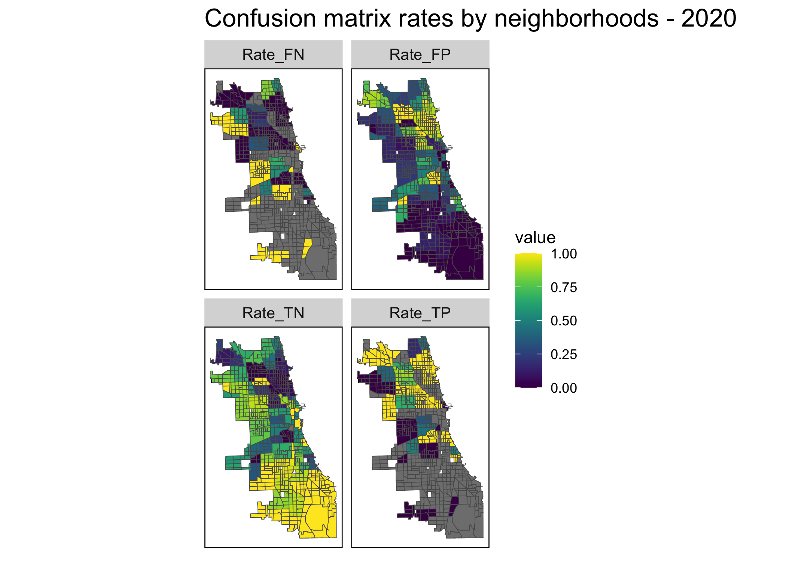<!-- -->

## CV on Different Income Levels


- The true positive rate is highest among tracts at the top 50% of income.
Like 2015, the true positive rate is lowest among tracts under moderate income level (Q2), which is accompanied by the highest false negative rate.   
- This indicates that gentrification may be underpredicted in those areas, even though they may continue to face influx of affluent home seekers and competitions for housing and resources.  
- The true negative rate is highest among tracts under low income level, which are likely traditionally marginalized neighborhoods still not receiving adequate investments.  
- False positive rate is still among tracts under the highest income (Q4), indicating that wealthiest tracts are easily predicted as gentrified neighborhoods.  


```r
testProbs3.20 <- 
  data.frame(class = as.character(dat.mod20$gentrified),
             probs = predict(final.mod, dat.mod20, type = "response"),
             income = dat.mod20$inc_level)

# plot error by income
testProbs.thresholds3.20 <- 
  iterateThresholds(data=testProbs3.20, observedClass = class, 
                    predictedProbs = probs, group = income)

filter(testProbs.thresholds3.20, Threshold == 0.15)  %>%
  dplyr::select(Accuracy, income, starts_with("Rate")) %>%
  gather(Variable, Value, -income) %>%
  ggplot(aes(Variable, Value, fill = income)) +
  geom_bar(aes(fill = income), position = "dodge", stat = "identity",colour = "white") +
  geom_text(aes(label = sprintf("%.2f", Value)),                      # Add labels
            position = position_dodge(width = 0.9), vjust = -0.5, size = 3) +
  scale_fill_manual(values = palette4) +
  labs(title="Confusion matrix rates by income levels - 2020",
       subtitle = "Threshold = 0.15", x = "Outcome",y = "Rate") +
  theme(axis.text.x = element_text(angle = 45, hjust = 1)) +
        theme_bw() +
  theme(plot.title = element_text(size = 12, face = "bold")) +
  theme(legend.title = element_text(size = 9),
        legend.text = element_text(size = 8)) +
        theme(axis.text.x = element_text(angle = 45, hjust = 1))
```

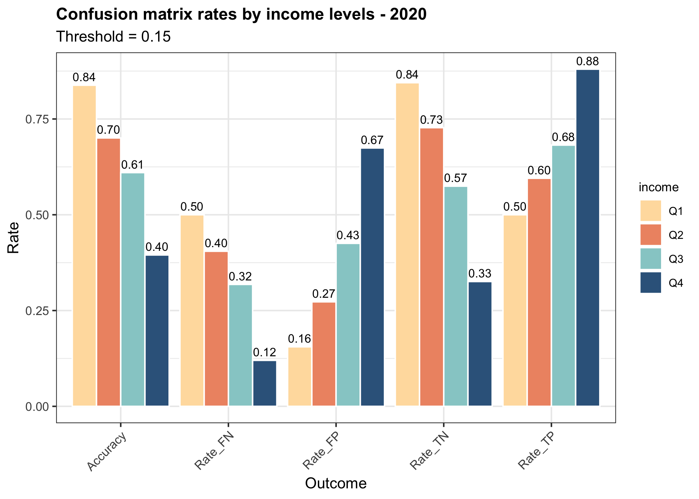<!-- -->


## CV on Different Education Levels

- Two patterns remain the same as 2015:  
  + The true negative rate is highest among tracts under low education level (Q1), which are likely traditionally marginalized neighborhoods still not receiving adequate educational investments.  
  + The true positive rate is highest among areas with the highest educational level (Q4), which, however, is accompanied by a highest false positive rate.  
- Additionally, the following new patterns are identified in 2020:
  + Tracts with bottom 50% educational attainment levels are undergoing gentrification too.  
  + However, gentrified tracts with below-median education are poorly identified, as shown by 0.39 to 0.50 true positive rate.  


```r
testProbs4.20 <- 
  data.frame(class = as.character(dat.mod20$gentrified),
             probs = predict(final.mod, dat.mod20, type = "response"),
             education = dat.mod20$edu_level)

# plot error by income
testProbs.thresholds4.20 <- 
  iterateThresholds(data=testProbs4.20, observedClass = class, 
                    predictedProbs = probs, group = education)

filter(testProbs.thresholds4.20, Threshold == 0.15)  %>%
  dplyr::select(Accuracy, education, starts_with("Rate")) %>%
  gather(Variable, Value, -education) %>%
  ggplot(aes(Variable, Value, fill = education)) +
  geom_bar(aes(fill = education), position = "dodge", stat = "identity",colour = "white") +
  geom_text(aes(label = sprintf("%.2f", Value)),                      # Add labels
            position = position_dodge(width = 0.9), vjust = -0.5, size = 3) +
  scale_fill_manual(values = palette4) +
  labs(title="Confusion matrix rates by education levels - 2020",
       subtitle = "Threshold = 0.15", x = "Outcome",y = "Rate") +
  theme(axis.text.x = element_text(angle = 45, hjust = 1)) +
        theme_bw() +
  theme(plot.title = element_text(size = 12, face = "bold")) +
  theme(legend.title = element_text(size = 9),
        legend.text = element_text(size = 8)) +
        theme(axis.text.x = element_text(angle = 45, hjust = 1))
```

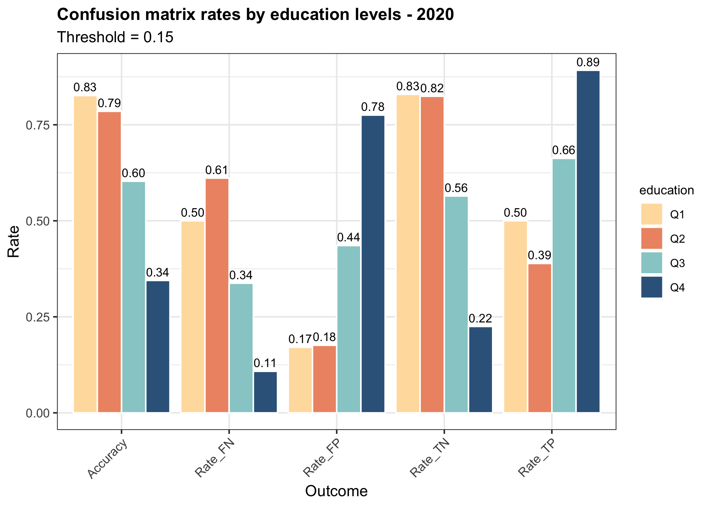<!-- -->


## CV on Different Dominant Races/Ethnicities

- Accuracy rate is higher among non-predominantly white tracts, represented by much higher true negative rate, and marginally higher true positive rate.  
- Higher true negative rate may be a result that a large amount of non-predominantly white areas are associated with lower-income and education attainment.  
- Unlike 2015, a higher true positive rate is associated with predominantly white areas as compared to non-white areas, but the false positive rate has increased by 0.69-0.50 = 0.19.   
- Comparatively, the true positive rate associated with non-predominantly white areas has decreased by 0.76-0.61 = 0.15, indicating the model’s lower ability to discern gentrification occurring in minority neighborhoods.  


```r
#predominantly white or not
testProbs5.20 <- 
  data.frame(class = as.character(dat.mod20$gentrified),
             probs = predict(final.mod, dat.mod20, type = "response"), #replace with final model
             dominant_white = dat.mod20$dom_white)

# plot error by income
testProbs.thresholds5.20 <- 
  iterateThresholds(data=testProbs5.20, observedClass = class, 
                    predictedProbs = probs, group = dominant_white)

filter(testProbs.thresholds5.20, Threshold == 0.15)  %>%
  dplyr::select(Accuracy, dominant_white, starts_with("Rate")) %>%
  gather(Variable, Value, -dominant_white) %>%
  ggplot(aes(Variable, Value, fill = dominant_white)) +
  geom_bar(aes(fill = dominant_white), 
           position = "dodge", stat = "identity",colour = "white") +
  geom_text(aes(label = sprintf("%.2f", Value)),             
            position = position_dodge(width = 0.9), vjust = -0.5, size = 3) +
  scale_fill_manual(values = palette2) +
  labs(title="Confusion matrix rates by predominantly white or not - 2020",
       subtitle = "Threshold = 0.15", x = "Outcome",y = "Rate") +
  theme(axis.text.x = element_text(angle = 45, hjust = 1)) +
        theme_bw() +
  theme(plot.title = element_text(size = 12, face = "bold")) +
  theme(legend.title = element_text(size = 9),
        legend.text = element_text(size = 8)) +
        theme(axis.text.x = element_text(angle = 45, hjust = 1))
```

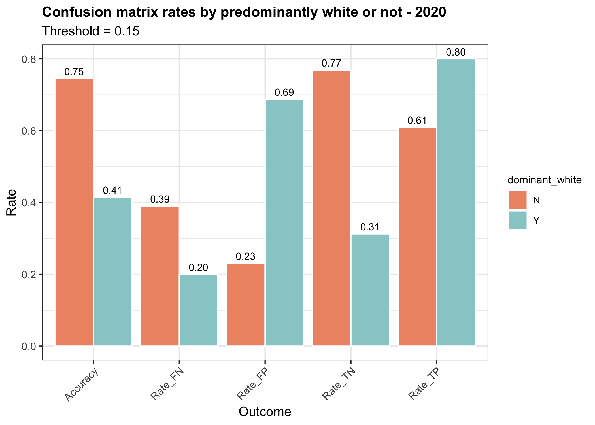<!-- -->

- Compared with 2015 findings, while the results still indicate higher accuracy and true negative rate corresponds with predominantly Hispanic areas, the true positive rate has significantly decreased (by approximately half).  
- This implies that the model’s ability to correctly predict gentrification among hispanic-dominant areas has decreased.  


```r
#predominantly hispanic or not
testProbs6.20 <- 
  data.frame(class = as.character(dat.mod20$gentrified),
             probs = predict(final.mod, dat.mod20, type = "response"), #replace with final model
             dominant_hispanic = dat.mod20$dom_hispanic)

# plot error by income
testProbs.thresholds6.20 <- 
  iterateThresholds(data=testProbs6.20, observedClass = class, 
                    predictedProbs = probs, group = dominant_hispanic)

filter(testProbs.thresholds6.20, Threshold == 0.15)  %>%
  dplyr::select(Accuracy, dominant_hispanic, starts_with("Rate")) %>%
  gather(Variable, Value, -dominant_hispanic) %>%
  ggplot(aes(Variable, Value, fill = dominant_hispanic)) +
  geom_bar(aes(fill = dominant_hispanic), 
           position = "dodge", stat = "identity",colour = "white") +
  geom_text(aes(label = sprintf("%.2f", Value)),                      # Add labels
            position = position_dodge(width = 0.9), vjust = -0.5, size = 3) +
  scale_fill_manual(values = palette2) +
  labs(title="Confusion matrix rates by predominantly Hispanic or not - 2015",
       subtitle = "Threshold = 0.15", x = "Outcome",y = "Rate") +
  theme(axis.text.x = element_text(angle = 45, hjust = 1)) +
        theme_bw() +
  theme(plot.title = element_text(size = 12, face = "bold")) +
  theme(legend.title = element_text(size = 9),
        legend.text = element_text(size = 8)) +
        theme(axis.text.x = element_text(angle = 45, hjust = 1))
```

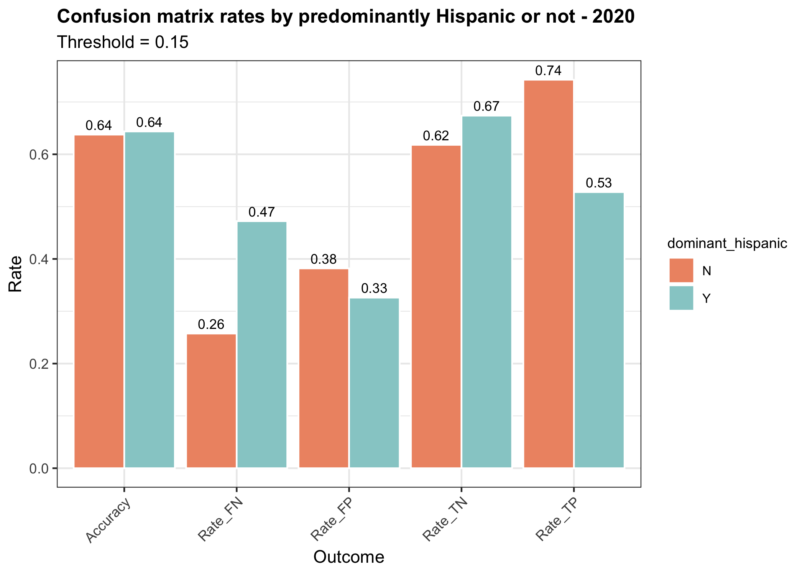<!-- -->

